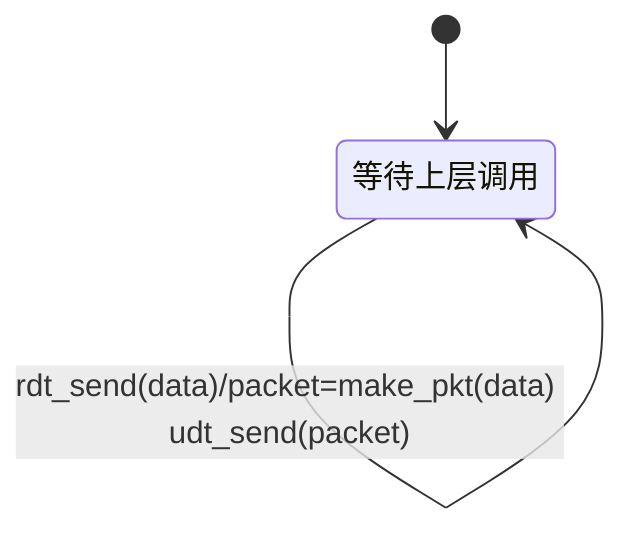

# Chapter 1 Computer Networks and the Internet  

### Delay, Loss, and Throughput in Packet-Switched Networks

Packet travals from one node to the subsequent node, it suffers from several types of delays at each node along the path. The most important of these delays are the **nodal processing delay, queuing delay, transmission delay, and progation delay**.

## 1.5 Protocol Layers and Their Service Models  

a. 5层Internet协议栈

- 应用层
- 传输层
- 网络层
- 链路层
- 物理层

b. 7层ISO OSI应用模型

- 应用层
- 表示层
- 会话层
- 传输层
- 网络层
- 链路层
- 物理层

7层ISO OSI应用模型相比5层模型，在应用层和传输层之间多了两层--表示层和会话层，由应用来决定这两层是否应该存在。

# Chapter 2 Application Layer  

## 2.1 Principles of Network Application

应用层协议只是网络应用的一部分，比如HTTP协议只是Web应用的一部分，STMP协议只是网络邮件应用的一部分。

## 2.2 The Web and HTTP

HyperText Transfer Protocol (HTTP),   是web的应用层协议。HTTP在两个程序中实现：客户端程序和服务器端程序。

Web页面由很多对象组成，一个对象是一个文件--如HTML文件、JPEG图片、java小程序等。它们可以通过单个URL来寻址。

每个URL由两部分组成：服务器的主机名（hostname）和对象的路径名（path name）。

HTTP是无状态协议，服务端不会储存客户端的任何状态。

### 非持续连接和持续连接

HTTP默认情况使用持续连接，也可以设置为非持续连接。

非持续连接：每当有一个request，客户端和服务器都会创建一个连接，在response之后，连接关闭。

持续连接：当有request时，客户端和服务器创建一个连接，并维持这个连接一段时间，在维持时，服务器不断响应request，同时将response通过这个连接传输，直到一方主动关闭连接。

### Cookies

Cooies允许网站持续追踪用户。

Cookie技术拥有四个组件：

1. 一个在HTTP 响应报文的cookie header行
2. 一个在HTTP 请求报文的cookie header行
3. 在用户端系统中被用户浏览器保存并管理的cookie文件
4. 网站的后端数据库

当网站响应客户端的初次请求时，网站会在它后端的数据库中保存用户的数据，同时在HTTP响应中加上`Set-cookie `头，它包含一个识别码；当浏览器得到这个response时，它会在自己管理的cookie文件中加上一个条目，这个条目包括服务器的hostname和识别码。之后每当浏览器请求页面的时候，它都会在request头中加上cookie头。服务器收到带cookie头的request后，会在自己的数据库中检索，以此来确定客户端的身份和其他信息。

可以使用cookie在无状态HTTP之上创建用户会话层。

### Web Caching

web cache也叫Proxy server（代理服务器）是代表原始Web服务器满足HTTP请求的网络实体。Web缓存有自己的磁盘存储，并在该存储中保存最近请求的对象的副本。

在客户端要请求数据时，首先和Web cache建立TCP连接，然后Web cache在自己的存储中查找是否有相应的资源。如果有的话直接将资源返回给客户端。如果没有的话，Web cache会与原始的服务器创建一条TCP连接，请求原始服务器的资源，得到资源后，Web cache将资源在其存储中保留一个副本，返回给客户端一个副本。

## 2.4 DNS—The Internet’s Directory Service  

**domain name system(DNS)**是使用DNS服务器层级结构实现的分布式数据库。DNS是一个应用层协议，允许主机来在分布式数据库中查询。它能够将URL中的hostname，比如`www.someschool.edu  `翻译成IP地址。

DNS服务器中存储着和hostname有关的资源记录，资源记录是一个包含以下字段的四元组：

*`(Name, Value, Type, TTL)  `*

`TTL`是time to live，即资源记录的存活时间。`Type`有几种不同的类型，`Name`和`Value`的意义依赖于`Type`。

- `Type=A`
- `Type=NS`
- `Type=CNAME`
- `Type=MX`

## 2.5 Peer-to-Peer File Distribution

在C/S结构中，要求有一个始终开机的server，但是在P2P结构中，每一个对等方既是客户端，也是服务端。

BitTorrent是现在最流行的P2P文件分发协议。在多数情况下，它能够显著减少文件分发时间。

## 2.6 Video Streaming and Content Distribution Networks  

**Dynamic Adaptive Streaming over HTTP(DASH)**。在DASH中，视频被编码成几种不同的版本，每个版本有不同的比特率和不同的质量等级。客户端动态地请求几秒钟长的视频片段块。

DASH允许具有不同Internet访问速率的客户端以不同的编码速率传输视频流

**Content Distribution Networks(CDNs)  **。CDN在多个地理位置上管理服务器，将视频（以及其他类型的Web内容，包括文档，图像和音频）的副本存储在其服务器中，并尝试将每个用户请求定向到CDN位置，以提供最佳的用户体验。


# Chapter 3 Transport Layer  

运输层协议为运行在不同主机上的应用进程之间提供了**逻辑通信** (logic communication) 功能。

运输层将主机间交付扩展到进程间交付被称为运输层的多路复用（transport-layer multiplexing）与多路分解（demultiplexing）。

TCP还为应用程序提供了几种附加服务：

- 可靠数据传输（reliable data transfer）：通过使用流量控制、序号、确认和定时器, TCP 确保正确地、按序地将数据从发送进程交付给接收进程。
- 拥塞控制（congestion control）：TCP 拥塞控制防止任何一条 TCP 连接用过多流量来淹没通信主机之间的链路和交换设备。TCP 力求为每个通过一条拥塞网络链路的连接平等地共享网络链路带宽。这可以通过调节 TCP 连接的发送端发送进网络的流量速率来做到。在另一方面， UDP流量是不可调节的。使用 UDP传输的应用程序可以根据其需要以其愿意的任何速率发送数据。

## 3.2 Multiplexing and Demultiplexing

多路复用与多路分解，也就是将由网络层提供的**主机到主机**交付服务延伸到为运行在主机上的应用程序提供**进程到进程**的交付服务。

一个进程（作为网络应用的一部分）有一个或多个 **套接字**（socket）它相当于从网络向进程传递数据和从进程向网络传递数据的门户。

将运输层报文段中的数据交付到正确的套接字的工 作称为**多路分解**（demultiplexing）。在源主机从不同套接字中收集数据块，并为每个数据块封装上首部信息（这将在以后用于分解）从而生成报文段，然后将报文段传递到网络层，所有这些工作称为**多路复用**（multiplexing）。

1. 无连接的多路复用与多路分解：一个 UDP 套接字是由一个二元组来全面标识的，该二元 组包含一个目的 IP 地址和一个目的端口号。
2. 面向连接的多路复用与多路分解：一个TCP套接字是由一个四元组(源 IP 地址，源端口号，目的 IP 地址，目的端口号)来标识的。

## 3.3 Connectionless Transport: UDP

UDP 只是做了运输协议能够做的最少工作。除了复用/分解功能及少量的差错检测外，它几乎没有对 IP 增加别的东西。

**UDP报文段结构**

| 源端口号 | 目的端口号 | 长度 | 检验和 | 单位 |
| -------- | ---------- | ---- | ------ | ---- |
| 16       | 16         | 16   | 16     | bit  |

## 3.4 Principles of Reliable Data Transfer

可靠数据传输提供给上层实体的服务抽象是一个可靠的通道，通过它可以传输数据。

因为rdt 1.0, rdt 2.x都是在假设可靠数据传输的情况下，故都没有启用计时器来应对丢包情况。

### 经完全可靠信造的可靠数据传输: rdt 1.O

### 经具有比特差错信道的可靠数据传输: rdt 2.0

在packet的传输过程中会发生差错的情况下，比较通用的做法是接收方回复**肯定确认(positive acknowledg- ment)**与**否定确认(negativeacknowledgment)**。这些控制报文使得接收方可以让发送方知道哪些内容被正确接收，哪些内容接收有误并因此需要重复。在计算机网络环境中，基于这样重传机制的可靠数据传输协议称为自动重传请求(Automatic Repeat reQuest, ARQ)协议。




### 经具有比特差错的丢包信道的可靠数据传输: rdt 3.0

此种情况下，面临着两个附加的问题：1.怎么检测包丢失；2. 包丢失时应该做什么。

校验和、序列号、ACK包和重传机制可以解决第二个问题。

对于第一个问题，发送方通过接收ACK包的时间来判别。

为了实现基于时间的重传机制，需要一个**倒计数定时器**(countdown timer)，在一个给定的时间量过期后，可中断发送方，然后重传。如果接收方接到两个连续的重复包后，则丢掉后来的包；如果发送方街道两个针对同一个包的确认后，针对后一个确认，什么也不做。

### 流水线可靠数据传输协议

在等待重传协议中，由于包在传输过程中所耗时间较多，发送方一直在等待接收方的确认包，造成了发送方的使用率较低。

解决方法是发送多个包而不用等待接收方对每个包的确认包。

#### 回退N步（Go-Back-N, GBN）

在回退 N 步(GBN)协议中，允许发送方发送多个分组(当有多个分组可用时)而不需等待确认，但它也受限于在流水线中未确认的分组数不能超过某个最大允许数 N。

随着协议的运行，该窗口在序号空间向前滑动。因此，N 常被称为**窗口长度(window size)**, GBN 协议也常被称为滑动窗口协议(sliding-window protocol)。

为每个包标上序号，随着包越发越多，包序号也越来越大，这种方式叫做**累积确认（cumulative acknowledgment）**

在GBN协议中，接收方会将所有失序的包丢弃。

#### 选择重传(Selective Reapeat, SR)

GBN虽然避免了在停等协议中利用率低的问题，但是当窗口大小和带宽延迟乘积都很大时，管道中可能会存在许多数据包，这会让GBN面临性能问题。

选择重传(SR)协议通过让发送方仅重传那些它怀疑在接收方出错(即丢失或受损)的分组而避免了不必要的重传。

SR 接收方将确认一个正确接收的分组而不管其是否按序。失序的分组将被缓存直到所有丢失分组(即序号更小的分组)皆被收到为止，这时才可以将一批分组按序交付给上层。

## 3.5 面向连接的运输：TCP

- TCP 被称为是面向连接的（ connection- oriented ）
- TCP 连接提供的是全双工服务 (full-duplex service ）
- TCP 连接也总是点对点（ point-to-point ）的。

三次握手初期设置的发送缓存（ send buffer ），TCP 可从缓存中取出并放人报文段中的数据数量受限于最大报文段长度（ Maximum Segmenl Size, MSS）， MSS 通常根据最初确定的由本地发送主机发送的最大链路层帧长度（即所谓的最大传输单元（ Maximum Transmission Unit, MTU ））来设置。

#### TCP 报文段结构

TCP 的首部一般是 20 字节（比 UDP 首部多 12 字节）。

| 源端口号 | 目的端口号 | **序号** | **确认号** | **首部长度** | 保留未用 | URG  | ACK  | PSH  | RST  | SYN  | FIN  | **接收窗口** | 因特网检验和 | 紧急数据指针 | 选项 | 单位 |
| -------- | ---------- | -------- | ---------- | ------------ | -------- | ---- | ---- | ---- | ---- | ---- | ---- | ------------ | ------------ | ------------ | ---- | ---- |
| 16       | 16         | 32       | 32         | 4            | 6        | 1    | 1    | 1    | 1    | 1    | 1    | 16           | 16           | 16           | ~    | bit  |

- 序号和确认号：TCP 把数据看成一个无结构的、有序的字节流，一个报文段的序号（ sequence number for a segment ）因此是该报文段首字节的字节流编号。
- 4 比特的首部长度字段（ header length field ）：该字段指示了以 32 比特的字为单位 TCP 首部长度，由于 TCP 选项字段的原因，TCP 首部的长度是可变的。（通常，选项字段为空，所以 TCP 首部的典型长度就是 20 字节。）
- 可选与变长的选项字段（ options field ）：该字段用于发送方与接收方协商最大报文段长度（ MSS ）时，或在高速网络环境下用作窗口调节因子时使用。
- 16 比特的接收窗口字段( receive window field )：该字段用于流量控制 。

#### 往返时间的估计与超时

1. 估计往返时间（Round Trip Time, RTT）

大多数 TCP 的实现仅在某个时刻做 SampleRTT 测量，而不是为每个发送的报文段测量一个 SampleRTT。

TCP 维持一个 SampleRTT 均值（称为 EstimatedRTT) 一旦获得一个新 SampleRTT 时， TCP 就会根据下列公式来更新 EstimaLedRTT：

>  EstimatedRTT = (1 - α）· EstimatedRTT + α·SampleRTT（α=0.125）

RTT 偏差 DevRTT，用于估算 SampleRTT一般会偏离 EstimatedRTT 的程度：

> DevRTT = (1-β）· DevRTT + β·|SampleRTT - EstimatedRTT|（β=0.25）

2. 设置和管理重传超时间隔

TimeoutInterval = EstimatedRTT + 4·DevRTT
推荐的初始 TimeoutInterval 值为 1 秒，当出现超时后，TimeoutInterval 的值将加倍，以免即将被确认的后继报文段过早出现超时。且一旦报文段收到并更新 EstimatedRTT 后，需要使用上述公式重新计算TimeoutInterval。

#### 可靠数据传输

在 TCP 发送方有3个与发送和重传有关的主要事件：从上层应用程序接收数据；定时器超时和收到 ACK。

- 超时间隔加倍
- 快速重传：如果 TCP 发送方接收到对相同数据的 3 个冗余 ACK ，就执行快速重传（fast retransmit)。
  - 由于 TCP 只是对已经接收到的最后一个按序字节数据进行重复确认，所以当接收到的报文段失序时可能会产生一个冗余 ACK。
- TCP 的差错恢复机制为 GBN 协议与 SR 协议的混合体。

### 流量控制

流量控制是一个速度匹配服务——匹配发送方发送的速率和接收方应用程序读取的速率。

如前所述，TCP发送方也可以由于IP网络中的拥塞而被调节;这种形式的发送方控制称为**拥塞控制**。

TCP通过让发送方维护一个称为**接收窗口(Receive Window)**的变量来提供流控制。

通俗地说，接收窗口用于给发送方一个指示一一该接收方还有多少可用的缓存空间：

LastByteRead：主机上的应用进程从缓存读出的数据流的最后一个字节的编号。
LastByteRcvd：从网络中到达的并且已放入主机 接收缓存中的数据流的最后一个字节的编号。
LastByteRcvd - LastByteRead ≤ Rev Buffer
rwnd = RcvBuffer - （LastByteRcvd - LastByteRead）
发送方：LastByteSent - LastByteAcked ≤ rwnd

最后当接收方的rwnd=0时，为了防止发送方被一直阻塞，发送方会再发送一个1字节的给发送方，以确认rwnd是否不再为0。

### TCP连接管理

假设在一台主机(客户机)上运行的进程希望启动与另一台主机(服务器)上的另一个进程的连接。客户端应用程序进程首先通知客户端TCP，它希望建立到服务器中的进程的连接。

1. 客户端TCP首先向服务器端TCP发送一个特殊的TCP段。这个特殊段不包含应用程序层数据。但是在段头中的一个标志位的**SYN**位被设置为1。这个段被叫做**SYN段**。客户端随机选择一个初始化序列值`client_isn`
2. 一旦包含TCP SYN段的IP数据报(IP datagram)到达服务器主机，服务器从数据报中提取TCP SYN段，将TCP缓冲区和变量分配给连接，并向客户机TCP发送连接授予(connection-granted)的段。这个段被称为**SYNACK segment**。其TCP段头的SYN为被置1，确认字段被设为`client_isn+1`，服务器选择自己的初始化序列值`server_isn`并加到TCP段头。
3. 在接收到SYNACK段后，客户端为连接分配缓冲区和变量。然后发送一个段给服务器用以确认服务器的SYNACK段，这个段将TCP段头的确认字段设为`server_isn+1`。SYN被置位0，因为连接已经被建立了。三次握手的第三阶段可能在段有效负载中携带客户机到服务器的数据。

在TCP连接两端的进程都能终止连接。过程如下，假设客户端终止连接。

首先，客户端发送的段中将**FIN**位置1，服务器收到后，返回一个确认段。

然后服务器发送一个段，将段中**FIN**位置1，客户端返回一个确认段。

此时连接关闭，资源都被回收。

## 3.6 Principles of Congestion Control 拥塞控制原理

## 3.7 TCP Congestion Control TCP拥塞控制

运行在发送方的 TCP 拥塞控制机制跟踪一个额外的变量，即拥塞窗口( congestion window，cwnd ）。

$$
LastbyteSent-LastbyteAcked\leq min\{cwnd, rwnd\}
$$
一个 TCP 发送方的“丢包事件”定义为: 要么出现**超时**，要么收到来自接收方的 3 个冗余 ACK。

1. 慢启动
   cwnd 的值以 1 MSS开始并且每当传输的报文段被确认就倍增。ssthresh的初始值一般为64kb。

- 超时： TCP 发送方将 cwnd 设置为 1 并重新开始慢启动过程，它还将第二个状态变量的值 ssthresh（“慢启动阈值”的速记）设置为 cwnd/2。
- cwnd超过ssthresh：转移到拥塞避免状态。
- 检测到3个冗余ACK：转移到快速恢复状态，ssthresh设置为 cwnd/2，cwnd设置为ssthresh+3*MSS。

2. 拥塞避免
   每当传输的报文段被确认cwnd就增加一个MSS。

- 超时：cwnd变为1，ssthresh设置为 cwnd/2。
- 检测到3个冗余ACK：ssthresh设置为 cwnd/2，转移到快速恢复状态，cwnd设置为ssthresh+3*MSS。

3. 快速恢复
   在快速恢复中，对于引起 TCP 进入快速恢复状态的缺失报文段，对收到的每个冗余的ACK, cwnd 的值增加一个 MSS。

**吞吐量**

- 当拥塞发生时，窗口长度为W字节。

$\mbox{一条连接的平均吞吐量}=0.75\times {\frac {W}{RTT}}$ 

- L表示丢包率。

$\mbox{一条连接的平均吞吐量}=1.22\times {\frac {MSS}{RTT\times \sqrt{L}}}$ 

5. 公平性
   拥塞控制机制是多个 TCP 连接最终收敛到共享带宽的状态。

影响公平性：

- UDP
- 并行TCP连接

# Chapter 4 The Network Layer: Data Plane

## 4.1 网络层概述

### 4.1.1 转发和路由

**网络层的作用：将分组从一台发送主机移动到一台接收主机。需要两种功能：**

* **转发**：当一个分组到达路由器的一条输入链路时，路由器必须将该分组移动到适当的输出链路
* **路由**：分组从发送方流向接收方时，网络层必须决定这些分组采用的路由或路径，路由选择算法

**转发**是路由器本地动作，**路由**是网络范围过程。比如开车从宾夕法尼亚到佛罗里达，转发相当于在某个路口选择某一条岔路，路由选择相当于规划从宾夕法尼亚到佛罗里达所有线路的过程。

每台路由都有一张**转发表**。路由器检查分组首部字段值（可能是目的地址或所属连接，看网络层协议）来转发分组，使用该值在转发表索引查询。该值指出了该分组将被转发的路由器输出链路接口。

路由选择算法决定了插入路由器转发表中的值。路由器接收路由选择协议报文，来配置转发表。有两种算法：

- 集中式
- 分布式

**分组交换机**：指一台通用分组交换设备，根据分组首部字段值从输入链路接口转移分组到输出链路接口。

- 链路层交换机：基于链路层字段中的值做转发决定
- 路由器：基于网络层字段值做转发决定

**连接建立：某些网络结构（ATM、帧中继、MPLS）除了转发和路由选择功能**，还有连接建立功能。要求从源到目的地沿着所选择路径彼此握手，建立连接。

*控制平面：传统方法*

路由算法在**每个**路由器中运行，转发和路由功能都包含在路由器中。此时数据平面和控制平面并没有完全分离

*控制平面：SDN方法*

数据平面和控制平面完全分离，路由设备只执行转发，而远程控制器计算和分发转发表。此时网络可以像程序一样编程，网络是“软件定义的”，因为计算转发表和与路由器交互的控制器是在软件中实现的。software-defined networking (SDN)。

### 4.1.2 网络服务模型

网络层可以提供的服务（注意IP并没有这些服务！）：

- 确保交付
- 具有时延上界的确保交付
- 有序分组交付
- 确保最小带宽：模仿发送方和接收方之间一条特定比特率传输链路的行为。发送速率低于该速率，分组不会丢失，且会在预定时延内到达
- 安全性服务：使用仅由源和目的地主机知晓的密钥，加密数据报，源加密，目的主机解密。此外还有数据完整性和源鉴别服务

因特网的网络层IP协议提供单一服务，**尽力而为**服务，无带宽保证，无丢包保证，无顺序保证，不定时，无拥塞指示。

## 4.2 路由器中有些什么

路由器中通常有四个组件：

- 输入端口
- 转发结构
- 输出端口
- 路由处理器

**路由转发平面**
        一台路由器的输入端口、输出端口和交换结构共同实现了转发功能，并且用硬件实现（软件太慢，需以纳秒时间尺度运行）
**路由控制平面**
        路由器的控制功能（执行路由选择协议、对上线或者下线链路进行响应、管理功能），在毫秒时间尺度上运行，用软件实现并在选择处理器上执行（一种cpu）

### 4.2.1 输入端口处理和基于目的地的转发

**查找**：
        查找必须在纳秒级别执行，不仅要用硬件执行查找，而且要对大型转发表使用快速查找算法，而且需要更快的内存访问速度（DRAM、SRAM）。

**影子副本**：
  转发表由路由选择处理器计算和更新，从路由选择处理器经过独立总线复制到（输入）线路卡（影子副本）
        有了转发表副本，转发决策能在每个输入端口本地做出，无须调动路由选择处理器，避免集中式处理

**排队**：
        查找确定了某分组输出端口，分组就能发送进入交换结构。一个被阻塞的分组必须在输入端口处排队。

### 4.2.2 交换结构

三种交换方式：

- 经内存交换

一个分组到达输入端口时，该端口会先通过中断方式向路由选择处理器发出信号。分组从输入端口复制到处理代路由器查找交换进内存，是器内存中（现由输入线路卡处理的）。早期路由选择处理器从首部提取目的地址，在转发表查找输出端口，将分组复制到输出端口

- 经总线交换

输入端口经一根共享总线将分组直接传送到输出端口，无需路由选择处理器的干预。路由器的交换带宽受总线速率限制

- 经互联网络交换

纵横式交换机，2N条总线组成网络，连接N各输入端口和N个输出端口。每条垂直的总线与每条水平的总线交叉，交叉点通过交换结构控制器开启闭合。某分组到达端口A，需要转发到Y，交换机控制器闭合总线A和Y的交叉点，A在其总线上发送分组，仅由Y接收；同时B也能发分组到X，因为没有公用总线。纵横式网络能并行转发多个分组。但是如果两个不同输入端口的两个分组的目标是同一个输出端口。则一个分组必须在输入端等待。

### 4.2.3 输出端口处理

接受存储在输出端口内存中的数据包，并通过输出链路传输它们。

### 4.2.4 何处出现排队

**输入、输出**端口都能形成分组队列，取决于流量负载、交换结构

值得注意的是输入端口的派对中有一种head-of-the-line (HOL) blocking，队列头部阻塞。

随着队列增长，路由器缓存空间会耗尽，出现丢包
需要路由器缓存吸收流量负载波动，需要多少缓存？
        少量TCP流：RTT * C（链路容量）
        大量TCP流：RTT* C/ (N^1/2)
输出端口排队，需要分组调度程序选出一个分组发送。提供服务质量保证。

### 4.2.5 分组调度

分组调度主要有以下三种：

- First-in-First-Out (FIFO) 先入先出
- Priority Queuing 优先级队列
- Round Robin and Weighted Fair Queuing (WFQ) 循环调度和加权公平队列

## 4.3 因特网协议(Internet Protocol, IP): IPv4, 编址(Addressing), IPv6，及其他


# Chapter 8 Security in Computer Networks

在1.6姐讨论过malware attacks（恶意软件攻击）, denial of service（拒绝服务）, sniffing（嗅探）, source masquerading（源冒充）, and message modification and deletion（消息修改和删除）。

## 8.1 什么是网络安全

安全通信的特性:

- **Confidentiality(机密性)**。只有发送方和接收方能理解报文的内容。所以报文必须要以某种形式**加密**。
- **报文完整性（Message integrity）**。报文在传输过程中不能被改变。
- **端点鉴别（End-point authentication）**。发送方和接收方都应该能够确认通信中涉及的另一方的身份
- **运行安全（Operational security）**

入侵者可能会：

- 窃听(eavesdropping)
- 修改、插入或删除消息或消息内容。

## 8.2 密码学原理(Principles of cryptography)

原始数据被称为plaintext(明文)，使用encryption algorithm(加密算法)可以得到ciphertext(密文)。

在**对称加密系统**中，收发方都持有相同的密钥。

在**公共加密系统**中，使用一对密钥。其中一个密钥是收发方都知道的(公共的)，另一个密钥只有一方知道。

### 8.2.1 对称加密系统

所有的密码算法都涉及用一件东西代替另一件东西。

凯撒密码-->单字符密码-->多字符密码

现在两种广泛使用的对称加密技术为：**stream ciphers(流密码)**和**block ciphers(密文块)**

- **密文块**：要加密的信息以k比特为单位进行处理。有诸如DES、 3DES、AES等
- **密文块链接**：只发送一个随机值以及第一个消息，然后让发送方和接收方使用已经计算出的编码块来代替后续的随机数。如CBC

### 8.2.2 公共密钥加密

公用密钥系统不光在加密中有用，还可以用于身份验证和数字签名。

举个例子

- Alice想要与Bob通讯。Alice和Bob都拥有public key(公钥)，它可以被任何人知道；Bob持有private key(私钥)，并且只有他自己知道。使用$K_{B}^{+}$和$K_{B}^{-}$分别代表Bob的公钥和私钥。
- 为了与Bob通信，Alice首先获取Bob的公钥。
- 然后，Alice用Bob的公钥和一个已知的加密算法将她的信息$m$加密给Bob;Alice计算出了$K_{B}^{+}(m)$。
- Bob接收到Alice的加密消息，并使用他的私钥和一个已知的解密算法来解密Alice的加密消息。即Bob计算出$K_{B}^{-}(K_{B}^{+}(m))$。现在存在着加密算法和技术使得$K_{B}^{-}(K_{B}^{+}(m))=m$。
- 也就是说，用Bob的公钥$K_{B}^{+}$加密报文$m$，然后再用Bob的私钥解密报文的密文形式就可以得到最初的明文$m$。公钥和私钥加密相互交换能够得到同样的结果，即$K_{B}^{-}(K_{B}^{+}(m))=K_{B}^{+}(K_{B}^{-}(m))=m$。
- 通过这种方式，Alice可以使用Bob的公开可用密钥向Bob发送秘密消息，而不需要他们中的任何一方分发任何密钥!

#### ***RSA***

（Ron Rivest, Adi Shamir, and Leonard Adleman)

RSA算法广泛地使用模n算术运算。使用模运算的加法和乘法有以下性质

$$[ (a\bmod n)+(b\bmod n)]\bmod \ n=(a+b)\bmod   n$$

$$[(a\bmod n)−(b\bmod n)]\bmod n=(a−b)\bmod n$$

$$[(a\bmod n)⋅(b\bmod n)]\bmod  n=(a⋅b)\bmod n$$

RSA由两个互相关联的部分组成：

- 公钥和私钥的选择。
- 解密和解密算法。

RSA用以下几步生成密钥：

1. 选择两个足够大的质数，$p$和$q$。RSA实验室建议$p$和$q$的乘积为1024位的数量级。

2. 计算$n=pq$和$z=(p-1)(q-1)$。

3. 选一个小于$n$且与$z$没有公因数(除了1)的数$e$。（在这种情况下，$e$和$z$是相对质数）。之所以使用字母*e*，是因为该值将用于encryption(加密)

4. 找到一个数$d$，使得$ed-1$能被$z$整除。之所以使用字母*d*，是因为要在decryption(解密)中使用这个值。这个表达式也可表示为$ed \bmod z=1$。
5. 公钥$K_{B}^{+}$是数对*(n, e)*，私钥$K_{B}^{-}$是数对*(n, d)*。

Alice加密和Bob解密过程如下：

- 假设Alice想向Bob发送一个由整数$m$表示的位模式($m < n$)。Alice对$m$求幂得到$m^{e}$，然后计算$m^{e}$除以$n$时的整数余数。即明文m加密后的值$c$，$c=m^{e}\bmod n$。对应于这个密文c的位模式被发送给Bob。
- 为了计算收到的密文报文，Bob计算$m=cd\bmod n$。这需要使用他的私钥*(n, d)*。

#### *Session Keys(会话密钥)*

注意到RSA的求幂是一个相当耗时的过程。DES要比RSA快许多。因此，RSA在实践中经常与对称加密方式结合使用。

如，Alice将要给Bob发送大量加密数据。首先，Alice选择一个密钥来加密数据，这个密钥被称为Session Key(会话密钥)，记为$K_{s}$；因为这是他们将用于对称加密的共享对称密钥，Alice需要告知Bob这个会话密钥；Alice使用Bob的公钥将这个会话密钥加密，即计算$c=(K_{s})^{e}\bmod n$；Bob接收到了这个被RSA加密的密钥$c$，然后解密它得到会话密钥。

#### *Why Does RSA Work?*


另一个流行的公钥加密算法是Diffie-Hellman算法.。

## 8.3 报文完整性和电子签名(Message Integrity and Digital Signatures)

为了验证消息，Bob需要验证：

1. 这条信息确实来自Alice
2. 消息在发送到Bob的途中没有被篡改。

### 8.3.1 密码学哈希函数(Cryptographic Hash Functions)

一个加密哈希函数需要具有以下附加属性：

- 要找到任意两个不同的信息x和y，使得$H(x)=H(y)$，这样做在计算上是不可行的

如果(m, H(m))是报文和由发送方生成的报文散列的话，则入侵者不可能伪造另一个报文y的内容，使得该报文具有与原报文相同的散列值。

### 8.3.2 报文鉴别码(Message Authentication Code, MAC)

为了鉴别报文完整性，除了使用密码散列函数外，发送方和接收方需要共享密钥s。这个共享的密钥只不过是一个比特串，它被称为鉴别密钥。使用这个共享秘密，报文完整性能够执行如下：

- 发送方生成报文m，用s级联m以生成m + s，并计算散列H(m + s)。H(m + s)被称为**报文鉴别码（Message Authentication Code, MAC）**。
- 然后发送方将MAC附加到报文m上，生成扩展报文(m, H(m + s))，并将报文发送给接受方。
- 接收方接收到一个扩展报文(m, h)，由于知道s，计算出报文鉴别码H(m + s)。如果H(m + s) = h，接受方得到结论：一切正常。

### 8.3.3 数字签名(Digital Signatures)

**数字签名**是一种在数字领域实现的密码技术。

使用私钥进行签名即可认证发送方的身份。主要是因为前面提到的性质：$K_{B}^{-}(K_{B}^{+}(m))=K_{B}^{+}(K_{B}^{-}(m))=m$。

使用数字签名的发送方的步骤：

- 发送方让他的初始长报文通过一个散列函数。然后他用自己的私钥对得到的散列进行数字签名。明文形式的初始报文连同已经数字签名的报文摘要一道被发送给接收方。

接收方的步骤：

- 接收方先把发送方的公钥应用于报文获得一个散列结果。然后再把该散列函数应用于明文报文以得到第二个散列结果。若果这两个散列匹配，则接收方可以确信报文的完整性及其发送方。

#### *公钥认证Public Key Certification*

产生公钥认证的原因是：如果Alice是接收方，Bob是发送方，Trudy是入侵者，如果Bob和Trudy都声明自己是Bob，同时都将自己的公钥给了Alice，发送的报文也都用自己的私钥加密，那么Alice其实是无法判别出Trudy不是Bob的。这个时候需要另一种方式来证明Bob的身份。

将公钥于特定实体绑定通常是由**认证中心（Certification Authority, CA）**完成的，CA的职责就是使识别和发行证书合法化。CA具有下列作用：

- CA认证一个实体的真实身份
- 一旦CA验证了某个实体的身份，这个CA会生成一个将其身份和实体的公钥绑定起来的证书。这个证书包含这个公钥和公钥所有者全局唯一的身份标识信息。由CA对这个证书进行数字签名。

## 8.4 端点鉴别(End-Point Authentication)

**端点鉴别**就是一个实体经过计算机网络向另一个实体证明其身份的过程。

**鉴别协议Authentication Protocol**。

AP1.0、AP2.0、AP3.0、AP3.1或多或少都有缺陷，于是有了AP4.0，与TCP的三次握手有异曲同工之妙。

不重数(nonce)是在一个协议的生存期中只使用一次的数。也就是说，一旦某协议使用了一个不重数，就永远不会再使用那个数字了。端点鉴别步骤如下：

- Alice向Bob发送报文“我是Alice”
- Bob选择一个不重数R，然后把这个值发给Alice
- Alice使用他与Bob共享的对称密钥$K_{A-B}$来加密这个不重数，然后把加密的不重数$K_{A-B}(R)$发回给Bob。由于Alice知道$K_{A-B}$并用它加密一个值，就使得Bob知道收到的报文是由Alice产生的。这个不重数用于确定Alice是活跃的。
- Bob解密收到的报文。如果解密出的不重数与他发给Alice的相等，则可以鉴别Alice的身份。

## 8.5 安全电子邮件Securing E-Mail

可以在互联网协议栈的前四层中的任何一层中提供安全服务。

### 8.5.1 Secure E-Mail

**提供机密性confidentiality**

Alice:

- 选择一个随机的对称会话密钥$K_{S}$
- 使用对称会话密钥加密报文$m$
- 使用Bob的公钥加密$K_{B}^{+}$对称密钥
- 将加密后的报文和加密后的对称密钥级联起来形成一个“包(package)”
- 将包发送给Bob的电子邮件地址

Bob：

- 使用自己的私钥$K_{B}^{-}$解密来获得对称会话密钥$K_{S}$
- 使用对称会话密钥$K_{S}$来解密报文$m$

**身份验证和消息完整性**

为了完成这项任务，我们使用数字签名和消息摘要。

Alice:

1. 将散列函数$H$作用在她的报文$m$上，得到消息摘要
2. 使用她的私钥$K_{A}^{-}$对散列函数的结果进行签名，创造一个电子签名
3. 将原始信息(未加密)与签名级联起来，得到一个包
4. 将这个包发给Bob的电子邮件地址

Bob：

1. 将Alice的公钥$K_{A}^{-}$作用在消息摘要上
2. 比较上个步骤得到的结果与自己的散列函数$H$作用在报文上的结果。如果两个结果相同，Bob就能确定这个报文来自Alice且未被修改

**同时提供这些服务**

如果要设计一个提供机密性、发送方鉴别和报文完整性的电子邮件系统，可以通过把会话密钥和数字签名结合起来实现：

Alice首先生成一个预备包，包括了Alice的初始报文和被数字签名过(使用$K_{A}^{-}$)的该报文的散列。然后Alice把这个预备包看作一个报文，使用$K_{S}$签名，再把经过签名后的报文和使用$K_{B}^{+}$加密后的$K_{S}$级联起来，发送给Bob。Bob收到这个包后，通过与Alice相反的步骤获得初始报文。

1. $m\rightarrow \boxed{H(.)}\rightarrow \boxed{K_{A}^{-}}\rightarrow K _{A}^{-}(H(m))\rightarrow setp2$

2. $m \oplus K_{A}^{-}(H(m))\rightarrow \boxed{K_{S}(.)}\rightarrow step4$
3. $K_{S}\rightarrow \boxed{K_{B}^{+}(.)}\rightarrow step4$
4. $step2\oplus step3$

Alice和Bob都需要获得对方的公钥，这一步能用CA来完成。

### 8.5.2 PGP

**Pretty Good Privacy(PGP)**是电子邮件加密方案的一个好例子。

### 8.6 使TCP连接安全Securing TCP Connections: SSL

TCP的强化版本是**安全套接字层（Secure Socket Layer, SSL）**，用安全性服务加强TCP，该安全性服务包括机密性、数据完整性和端点鉴别。SSL版本3的一个稍加修改的版本被称为**运输层安全性（Transport Layer Security, TLS）**。

SSL通常用于为通过HTTP发生的事务提供安全性。但是，由于SSL保护了TCP，因此它可以被运行在TCP上的任何应用程序使用。SSL提供一个简单的应用程序编程接口(API)与套接字，它与TCP的API类似。

尽管从技术上讲，SSL位于应用层，但从开发人员的角度来看，它是一种传输协议，提供了使用安全服务增强的TCP服务。

### 8.6.1 （重要部分）The Big Picture

SSL具有三个阶段：***握手(hanshake)、密钥导出(key derivation)和数据传输(data transfer)***。

#### 握手(hanshake)

 在握手阶段，Bob需要：①与Alice创建一条TCP连接；②验证Alice是真实的，而不是入侵者假冒的；③发送给Alice一个主密钥(master secret key)，Bob和Alice持用该主密钥生成SSL会话所需的所有对称密钥。

一旦TCP连接建立，Bob给Alice发送Hello消息，Alice用她得到的证书进行响应，证书中包含了Alice的公钥。因为该证书已被某CA证实过，B明白无误地知道该公钥属于Alice。然后，Bob产生一个主密钥（Master Secret, MS），使用Alice的公钥产生一个加密主密钥(Encrypted Master Secret, EMS)($EMS=K_{A}^{+}(MS)$)，并将该EMS发送给Alice。Alice用它的私钥解密该EMS从而得到MS。在这个阶段后，Bob和Alice均知道了用于这次SSL会话的主密钥。

#### 密钥导出(key derivation)

此时，由Bob和Alice共享的MS可以用作所有后续加密和数据完整性检查的对称会话密钥。然而，通常认为，对于Alice和Bob来说，使用不同的加密密钥以及使用不同的密钥进行加密和完整性检查更安全。因此，Alice和Bob都使用MS生成4个密钥：

- EB，用于从Bob发送到Alice的数据的会话加密密钥。
- MB，用于从Bob发送到Alice的数据的会话MAC密钥。
- EA，用于从Alice发送到Bob的数据的会话加密密钥。
- MA，用于从Alice发送到Bob的数据的会话MAC密钥。

生成这四个密钥的过程可以通过简单地将MS分割成四个密钥来实现。

#### 数据传输(data transfer)

SSL将数据流分割成记录(record)，对每个记录附加一个MAC用于完整性检查，然后加密该“记录+MAC”。为了产生这个MAC，Bob将数据连同密钥$M_{B}$，一起放入一个散列函数中。为了加密这个“记录+MAC”包，Bob使用他的会话加密密钥$E_{B}$。然后这个加密的包将传递给TCP经因特网传输。

这种方法不能对付入侵者将两个包调换顺序的情况。为了解决这个问题，发送方Bob维护一个序号计数器，计数器开始为0，Bob每发送一个SSL记录它都增加1。Bob计算MAC时，他把该序列号包括在MAC的计算中，此时即$H(m+(M_{B}+seqNum))$。

#### SSL记录(SSL Record)

前三个字段是不加密的。类型字段指出了该字段是握手报文还是包含应用数据的报文。它也用于关闭SSL连接。在接收端SSL使用长度字段以从到达的TCP字节流中提取SSL记录。

```asciiarmor
+--------------------------------------------+
|Type    |Version |Length  |Data        |MAC |
+--------------------------------------------+

                             +               +
                             +-------+-------+
                                     |
                                     +
                             Encrypted with EB

```

### 8.6.2 更完整的方面

#### 详细的SSL握手步骤：

在握手阶段，SSL允许Alice和Bob在SSL会话开始时就加密算法达成一致。步骤如下

1. 客户发送它支持的密码算法的列表，连同一个客户的不重数(nonce)。
2. 从该列表中，服务器选择一种对称算法、一种公钥算法和一种MAC算法。它把它的选择以及证书和一个服务器不重数返回给客户。
3. 客户验证该证书，提取服务器的公钥，生成一个**前主密钥（Pre-Master Secret, PMS）**，用服务器的公钥加密该PMS，并将加密的PMS发送给服务器。
4. 使用相同的密钥导出函数，客户和服务器独立地从PMS和不重数中计算出主密钥（MS）。然后该MS被切片以生成两个密码和两个MAC密钥。此外，当选择的对称密码采用CBC时，则两个初始化向量（IV）也从该MS获得，这两个IV分别用于该连接的两端。自此以后，客户和服务器之间发送的所有报文均被加密和鉴别。
5. 客户发送所有握手报文的一个MAC。
6. 服务器发送所有握手报文的一个MAC。

在第一步中，客户通常提供一个算法列表，其中有些算法强，有些算法弱。因为这些加密算法和密钥还没有被协商好，所以算法的这张列表以明文形式发送。而入侵者能够从列表中删除较强的算法，迫使客户选择一种较弱的算法。为了防止这种篡改攻击，在步骤5中客户发送一个级联它已发送和接收的所有握手报文的MAC。服务器能够比较这个MAC与它已接收和发送的握手报文的MAC，如果有不一致，服务器能够终止该连接。类似地，服务器发送一个它已经看到的握手报文的MAC，允许客户检查不一致性。

 在SSL中，不重数用于防御“连接重放(connection replay attack)”，保护的是**连接**，而序号用于防御在一个**进行中的会话**中重放个别分组，保护的是连接中分组的顺序。

#### 关闭连接(Connection Closure)

终止SSL会话的方法是，在类型(type)字段中指出该记录是否是用于终止该SSL会话的。通过包括这样一个字段，如果服务器在收到一个关闭SSL记录之前收到了一个TCP FIN，它可能知道这是入侵者的行为。

## 8.7 网络层安全性Network-Layer Security: IPsec and Virtual Private Networks

IP安全（IP Security）协议更常被称为IPsec，它为网络层提供了安全性。IPsec为任意两个网络层实体（包括主机和路由器）之间的IP数据报提供了安全。

跨越在多个地理区域上的某机构常常希望有自己的IP网络，使它的主机和服务器能够以一种安全和机密的方式彼此发送数据。为了达到这个目标，该机构能够实际部署一个单独的物理网络，该网络包括路由器、链路和DNS基础设施且与公共因特网完全分离。这样一种为特定的机构专用的分立网络被称为专用网络。专用网络可能耗资巨大，因为该机构需要购买、安装和维护它自己的物理网络基础设施。而使用**虚拟专用网（Virtual Private Network, VPN）**，机构和办公室之间的流量经公共因特网而不是经物理上独立的网络发送。而为了提供机密性，办公室之间的流量在进入公共因特网之前进行加密。

在IPsec协议族中，有两个主要协议：**鉴别首部（Authentication Header, AH）**协议和**封装安全载荷协议（Encapsulation Security Payload, ESP）**协议。AH协议提供源鉴别和数据完整性服务，但不提供机密性服务。ESP提供了源鉴别、数据完整性和机密性服务。

IPsec数据报在网络实体对之间发送。在从源实体向目的实体发送IPsec数据报之前，源和目的实体创建了一个网络层的逻辑连接。这个逻辑连接称为**安全关联（Security Association, SA）**，SA是单向的。

在SA内部，路由器将维护有关该SA的状态信息，这包括：

- SA的32比特的标识符，称为安全参数索引（Security Parameter Index, SPI）。
- SA的源接口和SA的目的接口。
- 将使用的加密类型。
- 加密密钥。
- 整性检查的类型。
- 鉴别密钥。

一个IPsec协议在它的安全关联数据库（Security Association Database, SAD）中存储其所有SA的状态信息，SAD是实体操作系统内核中得到一个数据结构。

IPsec有两种不同的分组形式，一种用于所谓的隧道模式，另一种用于所谓的运输模式。

IPsec数据报的分组格式:--------

将一个IPv4数据报转换成一个IPsec数据报的步骤：

- 在初始IPv4数据报后面附上一个“ESP尾部”字段。
- 使用算法和由SA规定的密钥加密该结果。
- 在这个加密量的前面附加上一个称为“ESP首部”的字段，得到的包称为“enchilada”。
- 使用算法和由SA规定的密钥生成一个覆盖整个enchilada的鉴别MAC。
- 该MAC附加到enchilada的后面形成载荷。
- 最后，生成一个经典IPv4首部字段的全新IP首部，该新首部附加到载荷之前。

IPsec使用**因特网密钥交换（Internet Key Exchange, IKE）**协议来交换密钥。

## 8.8 使无线网络安全(Securing Wireless LANs)

最初在802.11规范中标准化的安全机制，统称为**有线等效隐私(Wired Equivalent Privacy, WEP)**。

### 8.8.1Wired Equivalent Privacy (WEP)

WEP协议为在主机和无线接入点之间提供鉴别和数据的加密。WEP没有指定密钥管理算法，因此假定主机和无线接入点通过带外方法商定了密钥。鉴别以下列方式进行：

- 无线主机通过接入点请求鉴别。
- 接入点以一个128字节的不重数响应该鉴别请求。
- 无线主机用它与这个接入点共享的对称密钥加密这个不重数值。
- 接入点解密主机加密的不重数值。

假设主机和访问点都知道一个秘密的40位对称密钥$K_{S}$。此外，一个24位初始化向量($IV$)附加到40位密钥中，以创建一个64位密钥，该64位密钥将用于加密单个帧。$IV$随着帧变化，所以每个帧都被不同的64位密钥加密。

首先为数据有效负载计算一个4字节的CRC值(参见6.2节)。有效负载和四个CRC字节然后使用RC4流密码加密。RC4创建了密码流$k_{1}^{IV},k_{2}^{IV},k_{3}^{IV}...$来加密帧中的数据和CRC值。

将第$i$个数据$d_{i}$用由$K_{S},IV$生成的第$i$个密钥$k_{i}^{IV}$加密，能得到第$i$个密文$c{i}=d_{i}\oplus k_{i}^{IV}$。

解密时使用相反的步骤，$d{i}=c_{i}\oplus k_{i}^{IV}$。

### 8.8.2 IEEE 802.11i

IEEE 802.11i提供了更强的加密形式、一组可扩展的认证机制和密钥分发机制。

802.11i定义了AP可以与之通信的身份验证服务器。802.11i运行分为4个阶段：

1. **发现**。在发现阶段，AP通告它的存在以及它能够向无线客户节点提供的鉴别和加密的形式。客户则请求它希望的特定鉴别和加密形式。
2. **相互鉴别和主密钥（MK）生成。（Mutual authentication and Master Key (MK) generation.）**鉴别发生在无线客户和鉴别服务器之间。在这个阶段，接入点基本是其中继的作用，在客户和鉴别服务器之间转发报文。**可扩展鉴别协议（Extensible Authentication Protocol, EAP）**定义了客户和鉴别服务器之间交互时的请求/响应模式中使用的端到端报文格式。
3. **成对主密钥（Pairwise Master Key, PMK）生成(Pairwise Master Key (PMK) generation)**。MK是一个仅为客户和鉴别服务器所知的共享密钥，它们都使用MK来生成一个次密钥，即成对主密钥（PMK）。鉴别服务器则向AP发送该PMK。客户和AP现在具有一个共享的密钥，并彼此相互鉴别。
4. **临时密钥（Tamporal Key, TK）生成(Temporal Key (TK) generation)**.。使用PMK，无线客户和AP现在能够生成附加的、将用于通信的密钥。其中的关键是临时密钥，TK将被用于执行经无线链路向任意远程主机发送数据的链路级的加密。

## 8.9 运行安全性：防火墙和入侵检测系统

**Operational Security: Firewalls and Intrusion Detection Systems**

### 8.9.1 防火墙(FIreWalls)

防火墙是一个硬件和软件的结合体，它将一个机构的内部网络与整个因特网隔离开，允许一些数据分组通过而组织另一些分组通过。防火墙具有3个目标：

- 从外部到内部和从内部到外部的所有流量都通过防火墙。
- 仅被授权的流量允许通过。
- 防火墙自身免于渗透(penetration)。

防火墙能够分为3类：**传统分组过滤器、状态过滤器和应用程序网关**(traditional packet filters, stateful filters, and
application gateways.)。

#### 传统分组过滤器

传统分组过滤器独立地检查每个数据报，然后基于管理员特定的规则决定该数据报应当允许通过还是应当丢弃。过滤决定通常基于下列因素：

- IP源或目的地址。
- 在IP数据报中的协议类型字段：TCP、UDP、ICMP、OSPF等。
- TCP或UCP的源和目的端口。
- TCP标志比特：SYN、ACK等。
- ICMP报文类型。
- 数据报离开和进入网络的不同规则。
- 对不同路由器接口的不同规则。

#### 状态过滤器

在传统分组过滤器中，过滤决策是对每个分组单独作出的。状态过滤器实际上跟踪TCP连接，并使用这些知识来做出过滤决策。

#### 应用程序网关

为了更精细的安全性，防火墙必须将包过滤器与应用程序网关结合起来。应用程序网关查看IP/TCP/UDP报头之外的内容，并根据应用程序数据做出策略决策。

**应用程序网关**是特定于应用程序的服务器，所有应用程序数据(入站和出站)都必须通过该服务器。

### 8.9.2 入侵检测系统(Intrusion Detection Systems)

为了检测许多攻击类型，我们需要执行**深度分组检查**，也就是说，除了查看头字段之外，还要查看分组所携带的实际应用程序数据。

当观察到潜在的恶意流量时产生警报的设备称为**入侵检测系统(intrusion detection system, IDS)**。过滤出可疑流量的设备称为**入侵预防系统(intrusion prevention system, IPS)**。

IDS系统被广泛地分为**基于特征的系统(signature-based systems)**和**基于异常的系统(anomaly-based systems)**。

基于特征的IDS维护了一个范围广泛的攻击特征数据库。每个特征与一个入侵活动相关联的规则集。一个特征可能只是有关单个分组的特性列表，或者可能与一系列分组有关。

基于异常的IDS系统最大的特点是它们不依赖现有攻击的以前知识。基于异常的IDS系统在观察正常操作中的流量时创建流量配置文件，然后它会寻找统计上不寻常的数据包流。