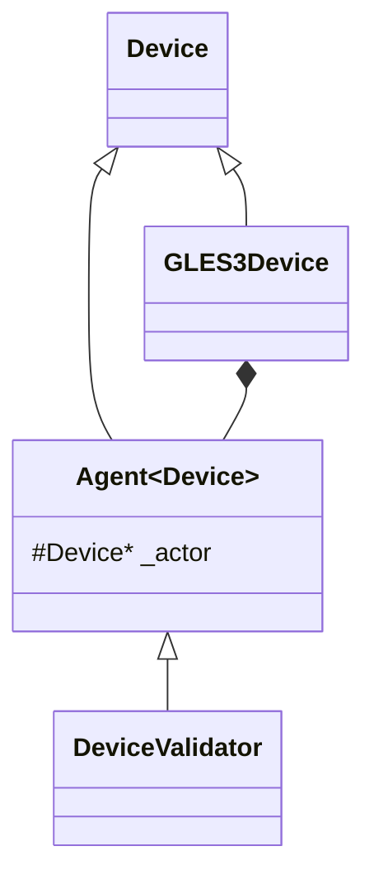

## Cocos Device 和消息队列

### Device

在 Cocos 中，引擎初始化后会创建 Device，这个 Device 是设备的抽象。一般情况下是对应渲染后端的 Device 抽象，如 `GLES3Device`。如果开启了验证，则会有两步

1. 创建实际的渲染后端，如 `GLES3Device`，得到一个 `Device` 指针；
2. 通过 `Agent` 类，使用实际渲染后端的 `Device` 指针包装成 `DeviceValidator` 对象。

Agent 类如下：

```c++
template <typename Actor>
class Agent : public Actor {
    ...
    inline Actor *getActor() const noexcept { return _actor; }
protected:
    Actor *_actor{nullptr};
};
```

它继承自自己的模板，仅仅给模板添加了一个方法 `getActor`，然后自己持有一个模板类的指针。这种编程技巧叫做 Mixin。

> [C++编程技巧：Mixin - 知乎 (zhihu.com)](https://zhuanlan.zhihu.com/p/460825741)：Mixin(Mix in) 是一种将若干功能独立的类通过继承的方式实现模块复用的C++模板编程技巧。其基本做法是将模板参数作为派生类的基类。
>
> Mixin本身是面向对象领域的一个非常宽泛的概念，它是有一系列被称为Mixin的类型，这些类型分别实现一个单独的功能，且这些功能本身是正交的。当需要使用这些功能时，就可以将不同的mixin组合在一起，像搭积木一样，完成功能复用。




通过两层包装后，最后返回的 `Device` 指针实际上是指向是子类 `DeviceValidator` 的指针。

#### `device->initialize(info)`

调用 `device->initialize(info)` 时，这里的 `device` 是指向 `DeviceValidator` 的指针。**所以在这个调用链中，上下文始终是 `DeviceValidator` 类**。首先搜索 `DeviceValidator` 类中的相关方法，找不到就在 `Agent<Device>` 寻找，还找不到就到 `Device` 类中寻找，最终调用了 `Device::initialize()`。这里的 初始化操作只初始化了 `DeviceValidator` 对象，而 `DeviceValidator` 对象中还持有 `GLES3Device` 指针，这个 `GLES3Device` 是还没有初始化的。

#### doInit

在 `Device::initialize()` 中调用了 `doInit()`，搜索方式同上，最终在 `DeviceValidator` 中找到此方法，然后调用了它。`DeviceValidator::doInit()` 中首先进行了一些校验，然后调用 `_actor->initialize(info)` 来初始化实际的渲染后端 Device。

#### `_actor->initialize(info)`

这里的 `_actor` 是 `DeviceValidator` 父类 `Agent<Device>` 中持有的指向 `Device` 的子类 `GLES3Device` 的指针。**在这个调用链中，上下文是 `GLES3Device` 类**。所以调用 `_actor->initialize(info)` 就试图调用 `GLES3Device::initialize()`，但实际上没有这个方法，方法在父类 `Device` 中，所以又调用了 `Device::initialize()` 方法。在`Device::initialize()` 中又调用 `doInit()`，在搜索链中找到了 `GLES3Device::doInit()`，这里进行了 `GLES3Device` 的实际初始化。

> 从上面可以看到，调用了两次 `initialize()` 和 `doInit()`，这里一定要分清楚，这两次调用是在不同的上下文中进行的：一次是 `DeviceValidator` 的上下文，最终初始化了 `DeviceValidator`；另一次是 `GLES3Device` 的上下文，最终初始化了 `GLES3Device`。
>
> ```mermaid
> sequenceDiagram
> 	DeviceManager->>+DeviceValidator: initialize
>  DeviceValidator->>-DeviceValidator: doInit
>  DeviceValidator->>+GLES3Device: initialize
>  GLES3Device->>-GLES3Device: doInit
> ```

在 `GLES3Device::doInit()` 中创建了消息队列，用于 commandBuffer：

```c++
    QueueInfo queueInfo;
    queueInfo.type = QueueType::GRAPHICS; // queue用于图像管线
    _queue = createQueue(queueInfo); // 创建GLES3Queue

    QueryPoolInfo queryPoolInfo{QueryType::OCCLUSION, DEFAULT_MAX_QUERY_OBJECTS, true};
    _queryPool = createQueryPool(queryPoolInfo);

    CommandBufferInfo cmdBuffInfo;
    cmdBuffInfo.type = CommandBufferType::PRIMARY;
    cmdBuffInfo.queue = _queue;
    _cmdBuff = createCommandBuffer(cmdBuffInfo); // 创建了GLES3CommandBuffer
```

在 `GLES3Device` 初始化后，`DeviceValidator` 将 `GLES3Device` 中的 queue、queuePool、cmdBuff取出，包装成了 `QueueValidator`，`QueryPoolValidator`、`CommandBufferValidator`。

## 消息队列

上面提到了在 `Device` 中会使用创建消息队列，但是目前还没有用起来。如果设置了分离线程并且Device支持分离线程的话，就会使用 `Device` 来创建设备代理 `DeviceAgent`。

> 在现在的一般情况下，除了AR和XR模式，设备都支持分离线程

在设备代理中，会使用实际 `Device` 的`Queue`、`QueryPool`、`CommandBuffer` 来创建各自的代理Agent，随后创建一个 `mainMessageQueue` 主消息队列，这个主消息队列存放的是大颗粒度消息，如 `acquire`、`present`、`copyTextureToBuffers`、`flushCommands` 等。最后使用 `mainMessageQueue` 开启另一个线程，即消息队列的消费者线程。这个消息队列消费者线程会不断读取 Message 并运行 message。主线程使用 `ENQUEUE_MESSAGE_X` 来打包一个消息并入队。

在使用 `CommandBuffer` 来创建代理时，同时创建了一个 `MessageQueue` 放在 `CommandBufferAgent` 中，这个消息队列存放的是 `CommandBufferAgent` 有关的小颗粒度command消息，如 `beginRenderPass`、`bindDescriptorSet`、`setViewport`、`copyTexture` 等。

#### 打包消息

使用 `ENQUEUE_MESSAGE_X` 来打包一个消息并加入消息队列。以 `CommandBufferAgent::setViewport` 中的 `ENQUEUE_MESSAGE_2` 宏为例：

```c++
#define WRITE_MESSAGE(queue, MessageName, Params)                                \
    {                                                                            \
        if (!queue->isImmediateMode()) {                                         \
            ccnew_placement(queue->allocate<MessageName>(1)) MessageName Params; \
        } else {                                                                 \
            MessageName msg Params;                                              \
            msg.execute();                                                       \
        }                                                                        \
    }

#define ENQUEUE_MESSAGE_2(queue, MessageName,                      \
                          Param1, Value1,                          \
                          Param2, Value2,                          \
                          Code)                                    \
    {                                                              \
        using Type1 = typename std::decay<decltype(Value1)>::type; \
        using Type2 = typename std::decay<decltype(Value2)>::type; \
                                                                   \
        class MessageName final : public Message {                 \
        public:                                                    \
            MessageName(                                           \
                Type1 In##Param1, Type2 In##Param2)                \
            : Param1(std::move(In##Param1)),                       \
              Param2(std::move(In##Param2)) {                      \
            }                                                      \
            void execute() override {                              \
                Code                                               \
            }                                                      \
            char const *getName() const noexcept override {        \
                return (#MessageName);                             \
            }                                                      \
                                                                   \
        private:                                                   \
            Type1 Param1;                                          \
            Type2 Param2;                                          \
        };                                                         \
        WRITE_MESSAGE(queue, MessageName, (Value1, Value2))        \
    }

void CommandBufferAgent::setViewport(const Viewport &vp) {
    ENQUEUE_MESSAGE_2(
        _messageQueue, CommandBufferSetViewport,
        actor, getActor(),
        vp, vp,
        {
            actor->setViewport(vp);
        });
}
```

`ENQUEUE_MESSAGE_X` 的第一个参数为要入队的消息队列，第二个参数为消息名，后续会用这个消息名生成一个 `Message` 的子类。

将 `setViewport` 中的消息展开为：

```c++
{
    using Type1 = typename std::decay<decltype(getActor())>::type;
    using Type2 = typename std::decay<decltype(vp)>::type;
    class CommandBufferSetViewport final : public Message {
    public:
        CommandBufferSetViewport( Type1 Inactor, Type2 Invp) :
            actor(std::move(Inactor)),
            vp(std::move(Invp)) { }
        void execute() override {
            {
                actor->setViewport(vp);
            }
        }
        char const *getName() const noexcept override {
            return ("CommandBufferSetViewport");
        }
    private:
        Type1 actor;
        Type2 vp;
    };
    {
        if (!_messageQueue->isImmediateMode()) {
            new (_messageQueue->allocate<CommandBufferSetViewport>(1)) CommandBufferSetViewport(getActor(), vp);
        } else {
            CommandBufferSetViewport msg(getActor(), vp);
            msg.execute();
        }
    }
}
```

这里创建了一个 `Message` 的子类 `CommandBufferSetViewport` 作为一个消息。

`ENQUEUE_MESSAGE_2` 的第三个参数和第四个参数为一对，`actor` 和 `getActor()` 分别为 `Param1` 和 `Value1`。`actor` 只是被使用为一个 `CommandBufferSetViewport` 的变量名而已，后续作为 Message 构造函数的入参 `Inactor` 使用，它用来初始化 `CommandBufferSetViewport` 的 `actor` 变量。`getActor()` 返回 `Actor*`，所以 `Type1` 为 `Actor*`。

同理第五个参数和第六个参数 `vp` 和 `vp` 为一对，前者作为名字，后者作为 `Value2`，取其类型 `Type2` 为 `Viewport`。

消息中由大括号 `{}` 包裹的为消息的动作，展开宏后发现它被放在了 `CommandBufferSetViewport` 的 `execute()` 函数中。

接下来的就是消息是否入队了：

- 如果 `_messageQueue` 的模式为立即模式，则此消息立即执行。
- 如果 `_messageQueue` 的模式不为立即模式，则调用 `new (_messageQueue->allocate<CommandBufferSetViewport>(1)) CommandBufferSetViewport(getActor(), vp)` 构造一个 `CommandBufferSetViewport` 消息，此消息放在 `_messageQueue->allocate<>(1)` 出来的内存中。即放在了队列关联的内存。

创建消息入队后，此消息暂时不一定会被立即读取，极有可能是延迟读取，此时会使用 `++_writer.pendingMessageCount` 来增加延迟消息计数，后续统一读取。

#### 消费者线程

在消费者线程的loop中 `MessageQueue::consumerThreadLoop()`，只要没有设置 terminate 标志位，线程就会一直调用 `MessageQueue::flushMessages()` 来读取 Message 并执行。如果没有消息，则会阻塞该消费者线程来等待生产者（这里就是主线程）来生产消息。

在生产者调用 `MessageQueue::finishWriting()` 后，会使用 `kick()` 通知阻塞的消费者线程来解除阻塞并拉取消息。

#### Writer & Reader

`WriterContext` 中的 `writtenMessageCount` 为 `std::atomic<uint32_t>` 可以进行原子化操作，在生产者结束写入后，`writtenMessageCount` 会原子化加上 `pendingMessageCount`，此时消息算是正式完全写入，可以读取了。然后通过上面提到的接触阻塞来拉取消息。

在 `pullMessages()` 拉取消息的过程中，原子化读取 `WriterContext::writtenMessageCount`，然后计算新消息的数量，读取对应数量的消息。
