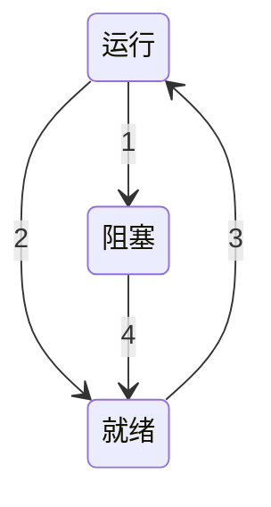

# Chapter 2 进程

## 2.2 线程

### 2.2.2 经典的线程模型

进程模型基于两种独立的概念：资源分组处理与执行。

尽管线程必须在某个进程中执行，但是线程和它的进程是不同的概念。进程用于把资源集中到一起。而线程则是CPU上被调度执行的实体。

| 每个进程中的内容   | 每个线程中的内容 |
| ------------------ | ---------------- |
| 地址空间           | 程序计数器       |
| 全局变量           | 寄存器           |
| 打开文件           | 堆栈             |
| 子进程             | 状态             |
| 即将发生的定时器   |                  |
| 信号与信号处理程序 |                  |
| 账户信息           |                  |



进程在三种状态中切换。

1. 进程因为等待输入而被阻塞
2. 调度程序选择另一个进程
3. 调度程序选择这个进程
4. 出现有效输入

### 2.2.4 在用户空间中实现线程

有两种主要的方法实现线程包：在用户空间中和在内核中。

第一种方法是把整个线程包放在用户空间中，内核对线程包一无所知。从内核角度考虑，就是按正常的方式进行管理，即单线程进程。这种方法第一个也是最明显的优点是，用户级线程包可以在不支持线程的操作系统上实现。

所有这一类实现都有同样的通用结构，线程在一个运行时系统的上层运行，改运心事系统是一个管理线程的过程的集合。如`phtread_create, pthread_exit, pthread_join和pthread_yield`等。

在用户空间管理线程时，每个进程需要有其专用的**线程表**(thread table)，用来跟踪该进程中的线程。该线程表由运行时系统管理。当一个线程转换到就绪状态或阻塞状态时，在该线程表中存放重新启动该线程所需的信息。

### 2.2.5 在内核中实现线程

现在不再需要运行时系统了。另外，每个进程中也没有线程表。相反，在内核中有用来记录系统中所有线程的线程表。当某个线程希望创建一个新线程或撤销一个已有线程时，它进行一个系统调用，这个系统调用通过对线程表的更新完成线程的创建或撤销工作。

所有能够阻塞线程的调用都以系统调用的形式实现，这与运行时系统过程相比，代价是相当可观的。

### 2.2.6 混合实现

### 2.2.7 调度程序激活机制

当内核了解到一个线程被阻塞之后（例如，由于执行了一个阻塞系统调用或者产生了一个页面故障），内核通知该进程的运行时系统，并且在堆栈中以参数形式传递有问题的线程编号和所发生事件的一个描述。内核通过在一个已知的起始地址启动运行时系统，从而发出了通知，这是对UNIX中信号的一种粗略模拟。这个机制称为**上行调用**（upcall）。

一旦如此激活，运行时系统就重新调度其线程。

### 2.2.8 弹出式线程

分布式系统中经常使用线程。一个例子是如何处理来到的消息，例如服务请求。传统的方法是将进程或者线程阻塞在一个`receive`系统调用上，等待消息到来。当消息到达时，该系统调用接收消息，并打开消息检查其内容，然后进行处理。

不过也有另一种处理方式。一个消息的到达导致系统创建一个处理该消息的线程，这种线程称为**弹出式线程**。

### 2.2.9 使单线程代码多线程化

将程序改写成多线程会引入一些问题。

首先是全局变量问题。

其次是许多库过程并不是**可重入**的。即，对于任何给定的过程，当前面的调用尚没有结束之前，可以进行第二次调用。

然后是信号。有些信号逻辑上是线程专用的，但另一些却不是。

由多线程引入的最后一个问题是堆栈的管理。

## 2.3 进程间通信

**进程间通信**（Inter Process Communication, IPC）。

有三个问题需要考虑

- 一个进程如何把信息传递给另一个
- 确保两个或更多的进程在关键活动中不会出现交叉
- 第三个与正确的顺序有关

这三个问题中的两个问题对于线程来说是同样适用的。

### 2.3.1 竞争条件

两个或多个进程读写某些共享数据，而最后的结果取决于进程运行时的精确时序，称为**竞争条件**（race condition）。

### 2.3.2 临界区

怎样比较竞争条件？实际上凡涉及共享内存、共享文件及共享任何资源的情况都会引发类似的错误。要避免这种错误，关键是要找出某种途径来阻止多个进程同时读写共享的数据。换言之，我们需要的是**互斥**（mutual exclusion），即以某种手段确保党一个进程在使用一个共享变量或文件时，其他进程不能做同样的操作。

避免竞争条件的问题也可以用一种抽象的方式进行描述。一个进程的一部分时间做内部计算或另外一些不会引发竞争条件的操作。在某些时候进程可能需要访问共享内存或共享文件，或执行另外一些会导致竞争的操作。我们把对共享内存进行访问的程序片段称作为**临界区域**（critical region）或**临界区**（critical section）。如果我们能够适当的安排，使得两个进程不可能同时处于临界区中，就能够避免竞争条件。

对于一个好的解决方案，需要满足以下4个条件：

1. 任何两个进程不能同时处于其临界区。
2. 不应对CPU的速度和数量做任何假设。
3. 临界区外运行的进程不得阻塞其他进程。
4. 不得使进程无限期等待进入临界区。

### 2.3.3 忙等待的互斥

本节中将讨论几种实现互斥的方案。

1. **屏蔽中断**

   这个方案并不好，因为把屏蔽中断的权利交给用户进程是不明智的。

2. **锁变量**

   当一个进程想进入临界区时，它首先测试这把锁。

   但是这种想法也包含了和假脱机目录一样的疏漏，会发生竞争条件。

3. **严格轮换法**

   连续测试一个变量直到某个值出现为止，称为**忙等待**（busy waiting）。由于这种方式浪费CPU的时间，所以通常应该避免。只有在有理由认为等待时间是非常短的情况下，才使用忙等待。用于忙等待的锁，称为**自旋锁**（spin lock）。

4. **Peterson解法**

   通过将锁变量与警告变量的思想相结合，最早提出了一个不需要严格轮换的软件互斥算法。

5. **TSL指令**

   现在来看需要硬件支持的一种方案。某些计算机中，特别是那些设计为多处理器的计算机，都有下面一条指令：

   `TSL RX, LOCK`

   称为**测试并加锁**（test and set lock），它将一个内存字lock读到寄存器RX中，然后在在该内存地址上存一个非零值。读字和写字操作保证是不可分割的，即该指令结束之前其他处理器不允许访问该内存字。执行TSL指令的CPU将锁住内存总线，以禁止其他CPU在本指令结束之前访问内存。

   为了使用TSL指令，要使用一个共享变量lock来协调对共享内存的访问。当lock为0时，任何进程都可以使用TSL将其设置为1，并读写共享内存。当操作结束时，进程用一条普通的`move`指令将lock的值重新设置为0.

   一个可替代`TSL`的指令是`XCHG`，它原子性地交换了两个位置的内容。所有的Intel x86 CPU在低层同步中使用`XCHG`指令。

### 2.3.4 睡眠与唤醒

Peterson解法和TSL或XCHG解法都是正确的，但它们都有忙等待的缺点。这些解法在本质上是这样的：当一个进程向进入临界区时，先检查是否允许进入，若不允许，则该进程将原地等待，直到允许为止。

这种方法不仅浪费了CPU时间，而且还可能引起预想不到的结果。

##### 生产者-消费者问题

考虑**生产者-消费者问题**（product-consumer），也称作**有界缓冲区**（bounded-buffer）问题。两个进程共享一个公共的固定大小的缓冲区。其中一个是生产者，将信息放入缓冲区；另一个是消费者，从缓冲区中取出信息。

在这里也会出现竞争条件。

由于进程间调度，有可能出现消费者刚刚读取count然后被调度到生产者的情况，此时count已经被改变，但是消费者比较的还是之前的值，此时竞争就出现了。

问题的实质在于发给一个（尚）未休眠进程的wakeup信号丢失了。如果它没有丢失，则一切都很正常。一种快速弥补的方法是修改规则，加上一个**唤醒等待位**。但是这从原则上讲，并没有从根本上解决问题。

### 2.3.5 信号量

信号量 是E. W. Dijkstra在1965年提出的一种方法，它使用一个整型变量来累计唤醒次数，供以后使用，在他的建议中引入了一个新的变量类型，称作**信号量**（semaphore）。一个信号量的取值可以为0（表示没有保存下来的唤醒操作）或者为正值（表示有一个或多个唤醒操作）。

Dijstra建议设立两种操作：`down`和`up`（分别为一般化后的`sleep`和`wakeup`）。对一信号量执行`down`操作，则是检查其是否大于0，若该值大于0，则将其值减1（即用掉一个保存的唤醒信号）并继续；若该值为0，则进程将睡眠，而且此时`down`操作并未结束。检查数值、修改变量值以及可能发生的睡眠操作均为一个单一的、不可分割的**原子操作**完成。保证一旦一个信号量操作开始，则在该操作完成或阻塞之前，其他进程均不允许访问该信号量。

`up`操作对信号量的值增1。如果一个或多个进程在该信号量上睡眠，无法完成一个先前的`down`操作，则由系统选择其中一个（如随机挑选）并允许该进程完成它的`down`操作。于是，对一个有进程在其上睡眠的信号量执行一次`up`操作之后，该信号量的值仍旧是0，但在其上睡眠的进程却少了一个。信号量的值增1和唤醒一个进程同样也是不可分割的。不会有某一个进程因执行`up`而阻塞，正如在前面的模型中不会有进程因执行`wakeup`而阻塞一样。

##### 用信号量解决生产者-消费者问题

用信号量解决丢失的wakeup问题。为确保信号量能正确工作，最重要的是要采用一种不可分割的方式来实现它。通常是将`down`和`up`作为系统调用实现，而操作系统只需在执行以下操作时暂时屏蔽全部中断：测试信号量、更新信号量以及在需要时使某个进程睡眠。由于这些动作只需要几条指令，所以屏蔽中断不会带来什么副作用。如果使用多个CPU，则么个信号量应由一个锁变量进行保护。

该解决方案使用了三个信号量：一个称为full，用来记录充满的缓冲区槽数；一个称为empty，记录空的缓冲槽数目；一个称为mutex，用来确保生产者和消费者不会同时访问缓冲区。full的初值为0，empty的初值为缓冲区槽的数目，mutex初值为1。供两个或多个进程使用的信号量，其初值为1，保证同时只有一个进程可以进入临界区，称作**二元信号量**（binary semaphore）。如果每个进程在进入临界区前都执行一个`down`操作，并在各个退出时执行一个`up`操作，就能够实现互斥。

信号量的另一种用途是用于实现**同步**（synchronization）。信号量full和empty用来保证某种事件的顺序发生或者不发生。

### 2.3.6 互斥量

如果不需要信号量的计数能力，有时可以使用信号量的一个简化版本，称为**互斥量**（mutex）。

互斥量是一个可以处于两态之一的变量：解锁和加锁。这样只需要一个二进制位表示它，不过实际上，常常使用一个整型两，0表示解锁，而其他所有值则表示为加锁。

```ASM
mutex_lock:
	TSL REGISTER, MUTEX          | 将互斥量复制到寄存器，并将互斥信号量置1
	CMP REGISTER, $0             | 互斥量是0吗？
	JZE ok                       | 如果是0，它被解锁，所以返回ok
	CALL thread_yield            | 互斥信号量忙；调度另一个线程
	JMP mutex_lock               | 稍后再试
ok: RET                          | 返回调用者；进入临界区


mutex_unlock:
	MOVE MUTEX, $0               | 将mutex置0
	RET                          | 返回调用者
```

`mutex_lock`取锁失败时，它调用`thread_yield`将CPU放弃给另一个线程。这样就没有忙等待。在该线程下一次运行时，它再一次对锁进行测试。

由于`thread_yield`只是在用户空间中对线程调度程序的一个调用，所以它的运行非常快捷。

##### 1. 快速用户区互斥量futex

futex是Linux的一个特性，它实现的基本的锁（很像互斥锁），但避免了陷入内核，除非它真的不得不这么做，因为来回切换到内核花销很大，所以这样做可观的改善了性能。

##### 2. pthread中的互斥量

pthread提供许多可以用来同步线程的函数。其基本机制是使用一个可以被锁定和解锁的互斥量来保护每个临界区。

除了互斥量之外，pthread提供了另一种同步机制：**条件变量**。互斥量在允许或阻塞对临界区的访问上是很有用的，条件变量则允许线程由于一些未达到的条件而阻塞。绝大部分情况下这两种方法是一起使用的。

条件变量上的主要操作时`pthread_cond_wait`和`pthread_cond_signal`，前者阻塞调用线程直到另一其他线程向它发送号（使用后一个调用）。当然，阻塞与等待的原因不是等待与发信号协议的一部分。被阻塞的线程经常是在等待发信号的线程去做某些工作、释放某些资源或是进行其他的一些活动。只有完成后被阻塞的线程才可以继续运行。条件变量允许这种等待与阻塞原子性地进行。当有多个线程被阻塞并等待同一个信号时，可以使用`pthread_cond_broadcast`调用。

条件变量与互斥量经常一起使用。这种模式用于上一个线程锁住一个互斥量，然后当它不能获得它期待的结果时等待一个条件变量。最后另一个线程会向它发信号，使它可以继续执行。`pthread_cond_wait`原子性地调用并解锁它持有的互斥量。由于这个原因，互斥量是参数之一。

### 2.3.7 管程

一种高级同步原语，称为**管程**（monitor）。

一个管程是一个由过程、变量及数据结构等组成的一个集合，它们组成一个特殊的模块或软件包。进程可在任何需要的时候调用管程中的过程，但它们不能在管程之外声明的过程中直接访问管程内的数据结构。

管程有一个很重要的特性，即任一时刻管程中只能有一个活跃进程，这一特性使管程能有效地完成互斥。

通过临界区互斥的自动化，管程比信号量更容易保证并行编程的正确性。

### 2.3.8 消息传递

**消息传递**（message passing）。这种进程间通信的方法使用两条原语`send`和`receive`，它们向信号量而不像管程，是系统调用而不是语言成分。因此，可以很容易地将它们加入到库例程中去。

##### 1. 消息传递系统的设计要点

消息传递系统面临着许多信号量和管程所未设计的问题和设计难点，特别是位于网络中不同机器上的通信进程的情况。为了防止消息丢失，发送方可以和接收方打成如下一致：一旦接收到信息，接收方马上回送一条特殊的**确认**（acknowledgement）消息。如果发送方在一段时间间隔内未收到确认，则重发消息。

消息系统还需要解决进程命名的问题，在**`send`**和**`receive`**调用中所指定的进程必须是没有二义性的。**身份认证**（authentication）也是一个问题。

##### 2. 用消息传递解决生产者-消费者问题

首先是如何对消息进行编址。一种方法是为每个进程分配一个唯一的地址，让消息按进程的地址编址。另一种方法是引入一种新的数据结构，称作**信箱**（mailbox）。信箱是一个用来对一定数量的消息进行缓冲的地方。当使用信箱时，在`send`和`receive`调用中的地址参数就是信箱的地址，而不是进程的地址。当一个进程试图向一个满的信箱发消息时，它将被挂起，直到信箱内有消息被取走，从而为新消息腾出空间。

### 2.3.9 屏障

最后一个同步机制是准备用于进程组而不是用于双进程的生产者—消费者情形的。在有些应用中划分了若干阶段，并且规定，除非所有的进程都就绪准备着手下一阶段，否则任何进程都不能进入下一个阶段。可以通过在每个阶段的结尾安置**屏障**（barrier）来实现这种行为。当一个进程到达屏障时，它就被屏障阻拦，直到所有进程都到达该屏障为止。

### 2.3.10 避免锁：读—复制—更新

最快的锁是根本没有锁。

在某些情况下，我们可以允许写操作来更新数据结构，即便还有其他的进程正在使用它。敲门在于确保每个读操作要么读取就的数据版本，要么读取新的数据版本，但绝不能是新旧数据的一些奇怪的组合。

**读—复制—更新**（Read-Copy-Update, RCU），将更新过程中的移除和再分配过程分离开来。

## 2.4 调度

当计算机系统是多道程序设计系统时，通常就会有多个进程或线程同时竞争CPU。只要有两个或更多的进程处于就绪状态，这种情形就会发生。如果只有一个CPU可用，那么就必须选择下一个要运行的进程。在操作系统中，完成选择工作的这一部分称为**调度程序**（scheduler），该程序使用的算法称为**调度算法**（scheduling algorithm）。

### 2.4.1 调度简介

##### 1. 进程行为

某些进程花费了绝大多数时间在计算上，而其他进程则在等待I/O上花费了绝大多数时间。前者称为**计算密集型**（compute-bound），后者称为**I/O密集型**（I/O-bound）。

##### 2. 何时调度

第一，在创建一个新进程之后，需要决定是运行父进程还是运行子进程。

第二，在一个进程退出时必须做出调度决策。

第三，当一个进程阻塞在I/O和信号量上或由于其他原因阻塞时，必须选择另一个进程运行。

第四，在一个I/O中断发生时，必须做出调度决策。

调度算法可分为两类：**非抢占式**调度算法挑选一个进程，然后让该进程运行直至被阻塞（阻塞在I/O上或等待另一个进程），或者直到该进程自动释放CPU。

相反，**抢占式**调度算法挑选一个进程，并且让该进程运行某个固定时段的最大值。如果在该时段结束时，该进程仍在运行，它就被挂起，而调度程序挑选另一个程序运行。进行抢占式调度处理，需要在时间间隔的末端发生时钟中断，以便把CPU控制返回给调度程序。

##### 3. 调度算法分类

不同的环境需要不同的调度算法，有三种环境：

- 批处理
- 交互式
- 实时

批处理——通常是非抢占式，提升了性能

交互式——抢占式是必须的

实时——抢占有时是不需要的

##### 4. 调度算法的目标

运行大量批处理作业的大型计算中心通常检查三个指标：

- **吞吐量**（throughout）是系统每小时完成的作业数量。
- **周转时间**（turnaround time）是指从一个批处理作业提交时刻开始直到该作业完成时刻为止的统计平均时间。
- **CPU利用率**常常用于对批处理系统的度量。

对于交互式系统，有不同的指标。最重要的是**最小响应时间**，即从发出命令到得到响应之间的时间。一个相关的问题是均衡性。

实时系统的特点是或多或少必须满足截止时间。

### 2.4.2 批处理系统中的调度

##### 1. 先来先服务

##### 2. 最短作业优先

##### 3. 最短剩余时间优先

### 2.4.3 交互式系统中的调度

##### 1. 轮转调度

**轮转调度**（round robin）。每个进程被分配一个时间段，称为**时间片**（quantum），即允许该进程在该时间段中运行。如果在时间片结束时该进程还在运行，则剥夺CPU并分配给另一个进程。如果该进程在时间片结束之前阻塞或结束，则CPU立即进行切换。

##### 2. 优先级调度

优先级调度：每个进程被赋予一个优先级，允许优先级最高的可运行进程先运行。

##### 3. 多级队列

CTSS（Compatible Time Share System）

##### 4. 最短进程优先

根据进程过去的行为进行推测，并执行估计运行时间最短的那一个。

##### 5. 保证调度

##### 6. 彩票调度

##### 7. 公平分享调度

### 2.4.4 实时系统中的调度

**实时**系统是一种时间起着主导作用的系统。

通常为**硬实时**（hard real time）和**软实时**（soft real time）。

### 2.4.5 策略和机制

将**调度机制**（scheduling mechanism）和**调度策略**（scheduling policy）分离。也就是将调度算法以某种形式参数化，而参数可以由用户进程填写。

### 2.4.6 线程调度

用户级线程和内核级线程之间的差别在于性能。用户级线程的线程切换需要少量的机器指令，而内核级线程需要完整的上下文切换，修改内存映像，使高速缓存失效，这导致了若干数量级的延迟。另一方面，在使用内核级线程时，一旦线程阻塞在I/O上就不需要像在用户级线程中那样将整个进程挂起。

## 2.5 经典的IPC问题

### 2.5.1 哲学家就餐问题

在就餐问题中，有可能出现所有的程序都在不停的运行，但都无法取得进展，称为**饥饿**（starvation）。

```C
#define N 5                   /* number of philosophers */
#define LEFT (i+N−1)%N        /* number of i’s left neighbor */
#define RIGHT (i+1)%N         /* number of i’s right neighbor */
#define THINKING 0            /* philosopher is thinking */
#define HUNGRY 1              /* philosopher is trying to get forks */
#define EATING 2              /* philosopher is eating */
typedef int semaphore;        /* semaphores are a special kind of int */
int state[N];                 /* array to keep track of everyone’s state */
semaphore mutex = 1;          /* mutual exclusion for critical regions */
semaphore s[N];               /* one semaphore per philosopher */

void philosopher(int i)       /* i: philosopher number, from 0 to N−1 */
{
    while (TRUE) {            /* repeat forever */
        think();              /* philosopher is thinking */
        take_forks(i);        /* acquire two forks or block */
        eat();                /* yum-yum, spaghetti */
        put_forks(i);         /* put both forks back on table */
    }
}

void take_forks(int i)        /* i: philosopher number, from 0 to N−1 */
{
    down(&mutex);             /* enter critical region */
    state[i] = HUNGRY;        /* record fact that philosopher i is hungry */
    test(i);                  /* try to acquire 2 forks */
    up(&mutex);               /* exit critical region */
    down(&s[i]);              /* block if forks were not acquired */
}

void put_forks(i)             /* i: philosopher number, from 0 to N−1 */
{
    down(&mutex);             /* enter critical region */
    state[i] = THINKING;      /* philosopher has finished eating */
    test(LEFT);               /* see if left neighbor can now eat */
    test(RIGHT);              /* see if right neighbor can now eat */
    up(&mutex);               /* exit critical region */
}

void test(i)                  /* i: philosopher number, from 0 to N−1 */
{
    if (state[i] == HUNGRY && state[LEFT] != EATING && state[RIGHT] != EATING) {
        state[i] = EATING;
        up(&s[i]);
    }
}
```

上面这种解法不仅没有死锁，而且对于任意位哲学家的情况都能获得最大的并行度。算法中使用一个数组`state`跟踪每一个哲学家是在进餐、思考还是饥饿状态（正在试图拿叉子）。一个哲学家只有在两个邻居都没有进餐时才允许进入到进餐状态。第$i$个哲学家的邻居则由宏`LEFT`和`RIGHT`定义，换言之，若$i$为2，则`LEFT`为1，`RIGHT`为3。

该程序使用了一个信号量数组，每个信号量对应以为哲学家，这样在所需的叉子被占用时，想进餐的哲学家就被阻塞。

### 2.5.2 读者—写者问题

哲学家就餐问题对于互斥访问有限资源的竞争问题（如I/O设备）一类的建模过程十分有用。另一个著名的问题是读者—写者问题，它为数据库访问建立了一个模型。例如，设想一个飞机订餐系统，其中由许多竞争的进程试图读写其中的数据。多个进程同时读数据库是可以接受的，但如果一个进程正在更新（写）数据库，则所有的其他进程都不能访问该数据库，即使读操作也不行。这里的问题是如何对读者和写者进行编程？

## 2.6 有关进程与线程的研究

几乎所有系统都把进程视为一个容器，用以管理相关的资源，如地址空间、线程、打开的文件、权限保护等。

线程是比进程更新的概念。

调度问题（包括单处理器和多处理器）也是研究者感兴趣的课题。

## 2.7 小结

为了隐藏中断的影响，操作系统提供了一个并行执行串行进程的概念模型。进程可以动态地创建赫尔终止，每个进程都有自己的地址空间。

有时候，在一个进程中使用多个线程时有益的。这些线程被独立调度并且有独立的栈，但是在一个进程中的所有线程共享一个地址空间。线程可以在用户态实现，也可以在内核态实现。

进程之间通过进程间通信原语来交换信息，如信号量、管程和消息。这些原语用来确保不会有两个进程同时在临界区中，以避免出现混乱。一个进程可以处在运行、就绪或阻塞状态，当该进程或其他进程执行某个进程间通信原语时，可以改变其状态。线程间通信也类似。

进程间通信原语可以用来解决诸如生产者—消费者问题、哲学家就餐问题、读者—写者问题和睡眠理发师问题等。但即使有了这些原语，也要仔细设计才能避免出错和死锁。

# Chapter 3 内存管理

现在有了**分层存储器体系**（memory hierarchy）概念。

操作系统中管理分层存储器体系的部分称为**存储管理器**（memory manager）。

## 3.1 无存储抽象

## 3.2 一种存储器抽象：地址空间

把物理地址暴露给进程会有严重的问题。

1. 如果用户程序可以寻址内存的每个字节，它们就可以很容易的破坏操作系统
2. 使用这种模型，想要同时允许多个程序时是困难的。

### 3.2.1 地址空间的概念

要使多个应用程序同时处于内存中并且不互相影响，需要解决两个问题：保护和重定位。

对比以前的解决办法，现在更好的办法是创建一个新从存储器抽象：地址空间。就像为进程的概念创造了一类抽象的CPU以运行程序一样，地址空间为程序创造了一种抽象的内存。**地址空间**是一个进程可用于寻址内存的一套地址集合。每一个进程都有一个自己的地址空间，并且这个地址空间独立于其他进程的地址空间（除了在一些特殊情况下进程需要共享它们的地址空间外）。

比较难的是给每个程序一个自己独有的地址空间，使得一个程序中的地址28所对应的物理地址与另一个程序中的地址28所对应的物理地址不同。

##### 基址寄存器与界限寄存器

这个简单的解决办法是使用**动态重定位**，简单地把每个进程的地址空间映射到物理内存的不同部分。

经典办法是给每个CPU配置两个特殊硬件寄存器，通常叫做**基址寄存器**与**界限寄存器**。当使用基址寄存器和界限寄存器时，程序装载到内存中连续的空闲位置且装载期间无需重定位。当一个进程运行时，程序的起始物理地址装载到基址寄存器中，程序的长度装载到界限寄存器中。

每次一个进程访问内存，取一条指令，读或写一个数据字，CPU硬件会在把地址发送到内存总线前，自动把基址值加到进程发出的地址值上。同时，它检查程序提供的地址是否等于或大于界限寄存器里的值。如果访问的地址超过了界限，会产生错误并终止访问。

使用基址寄存器和界限寄存器重定位的缺点是，每次访问内存都要进行假发和比较运算。加法在没有使用特殊电路的情况下会显得很慢。

### 3.2.2 交换技术

如果计算机的物理内存足够大，可以保存所有进程，那么之前提及的所有方案都或多或少是可行的。但实际上，所有进程所需的RAM数量总和通常要远远超出存储器能够支持的范围。

有两种处理内存超载的通用方法。最简单的策略是**交换**（swapping）技术，即把一个进程完整调入内存，使该进程运行一段时间，然后把它存回磁盘。空间进程主要存在磁盘上，所以当它们不运行时就不会占用内存。另一种策略是**虚拟内存**（virtual memory），该策略甚至能使程序在只有一部分被调入内存的情况下运行。

**首先是交换**。

交换在内存中产生了多个空闲区（hole， 也称为空洞），通过把所有的进程尽可能向下移动，有可能将这些小的空闲区合成一大块。该技术称为**内存紧缩**（memory compaction）。

为了应对运行时空间需求增长的进程，当换入或移动进程时为它分配一些额外的内存。

### 3.2.3 空闲内存管理

在动态分配内存时，操作系统必须对其进行管理。一般而言有两种方法。

##### 1. 使用位图的存储管理

使用位图方法时，内存可能被划分成小到几个字或大到几千字节的分配单元。每个分配单元对应于位图中的一位，0表示空闲，1表示占用（或相反）。

因为内存的大小和分配单元的大小决定了位图的大小，所以它提供了一种简单的利用一块固定大小的内存区就能对内存使用情况进行记录的方法。

但是有个缺点，将进程调入内存时，MM必须搜索位图，寻找连续0的串。查找位图中指定长度的连续0串是耗时的操作。

##### 2. 使用链表的存储管理

另一种方法是维护一个记录已分配内存段和空闲内存段的链表。其中链表中的一个节点或者包含一个进程，或者是两个进程之间的一块空闲区。

书中的示例中，链表的每一个节点都包含以下域：空闲区（H）或进程（P）的指示标志、起始地址、长度和指向下一节点的指针。

书中的示例中，段链表是按照地址排序的，其好处是当进程终止或被换出时链表的更新非常直接，一个要终止的进程一般有两个邻居（除非它是在内存的最底端或最顶端），它们可能是进程区也可能是空闲区。

进程表中表示终止进程的节点中通常含有指向对应于其段链表节点的指针，因此**段链表使用双向链表可能要比单向链表更方便**。这样的结构更易于找到上一个节点，并检查是否可以合并。

有几种算法可以用来为创建的进程（或换入的进程）分配内存：

- **首次适配**（first fit）：找第一个适配的
- **下次适配**（next fit）：找到合适区时记录当前位置，以便下次寻找时从上次结束的地方开始找
- **最佳适配**（best fit）：搜索整个链表，速度较慢，并且会产生大量无用的小空闲区。
- **最差适配**（worst fit）：总是分配最大的可用空闲区
- **快速适配**（quick fit）：为常用大小的空闲区维护单独的链表

## 3.3 虚拟内存

尽管基址寄存器和界限寄存器可以用于创建地址空间的抽象，但还有另一个问题需要解决：管理软件的膨胀（bloatware）。

**虚拟内存**（virtual memory）的基本思想是：每个程序拥有自己的地址空间，这个空间被分割成多个块，每一块称作一**页**或**页面**（page）。每一页有连续的地址范围。这些页被映射到物理内存，但并不是所有的页都必须在内存中才能运行程序。当程序应用到一部分在物理内存中的地址空间时，由硬件立刻执行必要的映射。当程序引用到一部分不在物理内存中的地址空间时，由操作系统负责将缺失的部分装入物理内存并重新执行失败的指令。

从某个角度来讲，虚拟内存是对基址寄存器和界限寄存器的一种综合。

### 3.3.1 分页

大部分虚拟内存系统中都使用一种称为**分页**（paging）的技术。

程序会引用内存地址，这些地址可以通过索引、基址寄存器、段寄存器或其他方式产生。

由程序产生的这些地址称为**虚拟地址**（virtual address），它们构成了一个**虚拟地址空间**（virtual address space）。在没有虚拟内存的计算机上，系统直接将虚拟地址送到内存总线；而使用虚拟内存的情况下，虚拟地址不是被直接送到内存总线上，而是被送到**内存管理单元**（Memory Management Unit， MMU），MMU把虚拟地址映射为物理内存地址。

虚拟内存地址空间按固定大小划分成**页面**（page）。在物理内存中对应的单元称为**页框**（page frame）。页面和页框的大小通常是一样的。

一般虚拟地址空间比物理内存大，所有只有一部分页面被映射到了物理内存中。在实际的硬件中，用一个**“在/不在”**位记录页面在内存中的实际存在情况。

如果地址对应的页面没有被映射，MMU会注意到，使CPU陷入到操作系统，这个陷阱称为**缺页中断**或**缺页错误**（page fault）。操作系统找到一个很少使用的页框并把它的内容写入磁盘，随后把需要访问的页面读入到刚才回收的页框中，修改映射关系，然后重新启动引起陷阱的指令。

在MMU映射机制中，如果地址为16位，这16位可以被分成4位的页号和12位的偏移量。

可用页号作为**页表**（page table）的缩影，以得出对应于该虚拟页面的页框号。如果“在/不在”位是0，则引起一个操作系统陷阱。如果是1，则将在页表中查到的页框号复制到输出寄存器的高3位中，再加上输入虚拟地址中的低12位偏移量。如此就构成了15位的物理地址。输出寄存器的内容随即被作为物理地址送到内存总线。

### 3.3.2 页表

作为一种最简单的实现，虚拟地址到物理地址的映射可以概括如下：虚拟地址被分成虚拟页号（高位部分）和偏移量（低位部分）两部分。

虚拟页号可用作页表的缩影，以找到该虚拟页面对应的页表项。

页表的目的是把虚拟页面映射为页框。从数学角度说，页表是一个函数，它的参数是虚拟页号，结果是物理页框号。通过这个函数可以把虚拟地址中的虚拟页面域替换成页框域，从而形成物理地址。

##### 页表项的结构

```
Caching
disabled    Modified Present/absent
      +     +        +
      |     |        |
      v     v        v
+-----+-+--++-+-----++-+---------------------------+
|----|  |  |  |     |  |      Page frame number    |
+-------++-+--+--+--+--+---------------------------+
         ^       ^
         |       |
         +       +
      Referenced Protection

```

**保护**（protection）位之处一个页面允许什么类型的访问。

为了记录页面的使用情况，引入了**修改**（modified）位和**访问**（referenced）位。

最后一位用于禁止该页面被高速缓冲。

再次强调：虚拟内存本质上是用来创造一个新的抽象概念——地址空间，这个概念是对物理内存的抽象，类似于进程是对物理处理器（CPU）的抽象。

### 3.3.3 加速分页过程

在任何分页系统中，都要考虑两个主要问题：

1. 虚拟地址到物理地址的映射必须非常快
2. 如果虚拟地址空间很大，页表也会很大

第一个问题，每次访问内存都需要映射，所有的指令最终都必须来自内存，并且很多指令也会访问内存中的树。所以映射要快。

第二个问题，现在计算机至少用32位的虚拟地址，并且64位越来越普遍。所以页表中的表项越来越多。并且每个进程都需要有自己的页表。

##### 1. 转换检测缓冲区

这种解决方案来基于一种观察：大多数程序总是对少量的页面进行多次访问，而不是相反。因此，只有很少的页表项会被反复读取，而其他的页表项很少被访问。

上面提到的解决方案是为计算机设置一个小型的硬件设备，将虚拟地址直接映射到物理地址，而不必再访问页表。这种设备称为**转换检测缓冲区**（Translation Lookaside Buffer, TLB），有时又称为**相联存储器***（associate memory）或**快表**，它通常在MMU中，包含少量的表项。

##### 2. 软件TLB管理

到目前为止，我们已经假设每一台具有虚拟内存的及其都具有由硬件识别的页表，以及一个TLB。在这种设计中，对TLB的管理和TLB的失效处理都完全由MMU硬件来实现。只有在内存中没有找到这个页面时，才会陷入到操作系统中。

无论是用硬件还是软件来处理TLB实现，常见方法都是找到页表并执行索引操作以定位将要访问的页面。

当用软件TLB管理时，一个基本的要求是要理解两种不同的TLB失效的区别在哪里。当一个页面访问在内存而不再TLB中时，将产生**软失效**（soft miss）。那么此时要做的就是更新一下TLB，不需要产生磁盘I/O。相反，当页面本身不在内存中（当然也不在TLB中）时，将产生**硬失效**。此时需要一次磁盘存取以装入该页面。硬失效的处理时间往往是软失效的百万倍。在页表结构中查找相应的映射被称为**页表遍历**。

实际情况下，如果页表遍历没有在进程中的页表中找到需要的页，从而引发了一个缺页错误，此时有三种可能：

1. 所需页面就在内存中，但未记录在该进程的页表中，比如该页面可能已由其他进程从硬盘中调入内存。这种情况下只需要把所需的页面正确映射到页表中，而不需要再从硬盘调入。这是一种典型的软失效，称为**次要缺页错误**
2. 如果需要从硬盘重新调入页面，这就是**严重缺页错误**。
3. 程序可能访问了一个非法地址，根本不需要向TLB中新增映射。此时系统一般会通过报告**段错误**来终止改程序。只有这种属于程序错误。

### 3.3.4 针对大内存的页表

在原有的内存页表的方案之上，引入TLB可以加快虚拟地址到物理地址的转换。不过这不是唯一需要解决的问题。另一个问题是怎样处理巨大的虚拟地址空间。有两种解决办法。

##### 1. 多级页表

第一种广发是采用**多级页表**。

下图中，32位虚拟地址被分为10位的PT1域、10位的PT2域和12位的Offset域。因为偏移量为12位，所以页面大小是4KB，共有$2^{20}$个页面。

引入多级页表的原因是避免把全部页表一直保持在内存中。特别是那些从不需要的页表就不应该保留。

比如一个需要12MB内存的进程，其最底端是4MB的程序正文段，后面是4MB的数据段，顶端是4MB的堆栈段，在数据段上方和堆栈段下方之间是大量根本没有使用的空闲区。


> 图3-13  a)一个由两个页表域的32位地址；b)二级页表

上图中，左边是顶级页表，它有1024个表项，对应于10位的PT1域。当一个虚拟地址被送到MMU时，MMU首先提取PT1域并把该值作为方位顶级页表的索引。因为整个4GB（即32位）虚拟地址空间已经按4KB大小分块，所以顶级页表中这1024个表项的每一个都表示4M的块地址范围。

由索引顶级页表得到的表项中含有二级页表的地址或页框号。如顶级页表的表项0指向程序正文的页表，表项1指向数据的页表，表项1023指向堆栈的页表，其他表项未用。现在把PT2域作为访问选定的二级页表的缩影，以便找到该虚拟页面的对应页框号。

##### 2. 倒排页表

针对页式调度层级不断增长的另一种解决方案是**倒排页表**（inverted page table）。在这种设计中，实际内存中的每一个页框对应一个表项，而不是每个虚拟页面对应一个表项。

虽然倒排页表节省了大量的空间（至少当虚拟地址空间比物理空间大得多的时候是这样），但它也有严重的不足：从虚拟地址到物理地址的转换会变得很困难。当进程$n$访问虚拟页面$p$时，硬件不再能通过把$p$当做指向页表的一个索引来查找物理页框。取而代之的是，它必须搜索整个倒排页表来查找每一个表项$(n, p)$.


## 3.4 页面置换算法

当发生缺页中断时，操作系统必须在内存中选择一个页面将其换出内存，以便为即将调入的页面腾出空间。如果要换出的页面在在内存驻留期间已经被修改过了，就必须把它写回磁盘以更新该页在磁盘上的副本；如果该页面没有被修改过，那么它在磁盘上的副本已经是最新的，不需要回写。直接用调入的页面覆盖被淘汰的页面就可以了。

### 3.4.1 最优页面置换算法

该算法是这样工作的：在缺页中断发生时，有些页面在内存中，其中有一个页面（包含紧接着的下一条指令的那个页面）将很快被访问，其他页面则可能要到10、100或1000条指令后才会被访问，每个页面都可以用在该页面首次被访问前所要执行的指令数作为标记。

最优页面置换算法规定应该置换标记最大的页面。

这个算法唯一的问题就是它是无法实现的。

### 3.4.2 最近未使用页面置换算法

为使操作系统能够收集有用的统计信息，在大部分具有虚拟内存的计算机中，系统为每一页面设置了两个状态位。当页面被访问（读或写）时设置R位；当页面被写入（即修改）时设置M位。这些位包含在每一个表项中。

可以用R位和M位来构造一个简单的页面置换算法：当启动一个进程时，它的所有页面的两个位都由操作系统设置成0，R位被定期地（比如在每次时钟中断时）清零，以区别最近没有被访问的页面和被访问的页面。

当发生缺页中断时，操作系统检查所有的页面并根据他们当前的R位和M位的值，把它们分为4类：

- 第0类：没有被访问，没有被修改。
- 第1类：没有被访问，已被修改。
- 第2类：已被访问，没有被修改。
- 第3类：已被访问，已被修改。

**NRU**(Not Recently Used, 最近未使用)算法随机地从类编号最小的非空类中挑选一个页面淘汰。

### 3.4.3 先进先出页面置换算法

另一种开销较小的页面置换算法时**FIFO**（First-In First-Out，先进先出）算法。

由操作系统维护一个所有当前在内存中的页面的链表，最新进入的放在表尾，最早进入的放在表头。

淘汰表头的页面，并把新加入的方在表尾。

### 3.4.4 第二次机会页面置换算法

FIFO算法可能会把经常使用的页面置换出去，为了避免这个问题，对该算法做一个简单的修改：检查最老页面的R位。如果R位是0，那么这个页面既老又没有被使用，可以立刻置换调；如果是1，就将R位清零，并把该页面放到链表的尾端，修改它的装入时间使它就像刚装入的一样，然后继续搜索。

这一算法称为**第二次机会（second chance）**算法。

### 3.4.5 时钟页面置换算法

尽管第二次机会算法是一个比较合理的算法，但它经常要在链表中移动页面，既降低了效率又不是很有必要。一个更好的办法是把所有的页面都保存在一个类似时钟面的环形链表中，一个表针指向最老的页面。


当发生缺页中断时，算法首先表针指向的页面，如果它的R位是0就淘汰该页面，并把新的页面插入这个位置，然后把表针前移一个位置；如果R位是1就清除R位并把表针前移一个位置。重复这个过程直到找到了一个R位为0的页面为止。

### 3.4.6 最近最少使用页面置换算法

在缺页中断发生时，置换未使用时间最长的页面。这个策略称为**LRU**（Least Recently Used，最近最少使用）页面置换算法。

虽然LRU在理论上是可以实现的，但代价很高。

### 3.4.7 用软件模拟LRU

前面一种LRU算法虽然在理论上是可以实现的，但只有非常少的计算机拥有这种硬件。因此，需要一个能用软件实现的解决方案。一种可能的方案称为**NFU**（Not Frequently Used，最不常用）算法。该算法将每个页面与一个软件计数器相关联，计数器的初始值为0。每次时钟中断时，由操作系统扫描内存中的所有页面，将么个页面的R位（它的值是0或1）加到它的计数器上。这个计数器大体上跟踪了各个页面被访问的频发程度。发生缺页中断时，则置换计数器最小的页面。

使用**老化**（aging）算法修改NFU。修改分为两部分：首先，在R位被加进之前先将计数器右移一位；其次，将R位加到计数器的最左端而不是最右端的位。

当发生缺页中断时，将置换计数器最小的页面。

### 3.4.8 工作集页面置换算法

在单纯的分页系统里，刚启动进程时，在内存中并没有页面。在CPU试图取第一条指令时就会产生一次缺页中断，使操作系统装入含有第一条指令的页面。其他由访问全局数据和堆栈引起的中断紧随着发生。一段时间后，进程需要的大部分页面都已经在内存了，进程开始在较少缺页中断的情况下运行。这个策略称为**请求调页**（demand paging），因为页面是在需要时被调入的，而不是预先装入。

大部分的进程都表现出一种**局部性访问**行为，即在运行的任何阶段，它都之访问较少的一部分页面。

一个进程当前正在使用的页面集合称为它的**工作集**。

不少分页系统都会设法跟踪进程的工作集，以确保在让进程运行以前，它的工作集就已在内存中了。该方法称为**工作集模型**。其目的在于大大减少缺页中断率。在进程运行前预先装入其工作集页面也称为**预先调页**（preparing）。请注意工作集是随着时间变化的。

为了实现工作集模型，操作系统必须跟踪哪些页面正在工作集中。通过这些信息可以直接推导出一个合理的页面置换算法：当发生缺页中断时，淘汰一个不再工作集中的页面。

根据定义，工作集就是最近$k$次内存访问所使用过的页面的集合。为了实现工作集的算法，必须预先选定$k$的值。一旦选定，集合就是唯一确定的了。

现在有一些近似的方法，不是向后查找最近$k$次的内存访问，而是考虑其执行时间。现在可以这样定义：工作集是过去10ms内中的内存访问所用用到的页面的集合。要注意到，每个进程只计算它自己的执行时间。

该算法的工作方式如下。如前所述，假定使用硬件来置R位和M位。同时也会有时钟中断来清除R位。

在处理每个表项时，都需要检查R位。如果它是1，就把当前实际时间写进表项的“上次使用时间”域，以表示缺页中断发生时该页面正在被使用。既然该页面在当前时钟滴答中已经被访问过，那么很明显它应该出现在工作集中，并且不应该被删除（假定$\tau$很快多个时钟滴答）。

如果R是0，那么表示在当前时钟滴答中，该页面还没有被访问过，则它就可以作为候选者被置换。为了知道它是否应该被置换，需要计算它的生存时间（即当前实际运行时间减去上次使用时间），然后与$\tau$做比较，如果大于，那么这个页面就不再工作集中，而用新的页面置换它。扫描会继续进行以更新剩余的表项。

然而，如果R是0同时生存时间小于或等于$\tau$，则该页面仍然在工作集中。这样就要报该页面临时保留下来，但是要记录生存时间最长（“上次使用时间”的最小值）的页面。如果扫描完整个页表却没有找到合适被淘汰的页面，就淘汰生存时间最长的页面。


### 3.4.9 工作集时钟页面置换算法

当缺页中断发生后，需要扫描整个页表才能被确定淘汰的页面，因此基本工作集算法时比较费时的。有一种改进的算法，它基于时钟算法，并且使用了工作集信息，称为**WSClock**（工作集时钟）算法。由于它实现简单，性能较好。所以在实际工作中得到了广泛应用。

与时钟算法一样，所需的数据结构是一个以页框为元素的循环表。最初是空的，当装入第一个页面后，把它加到该表中。随着更多的页面的加入，它们形成一个环。每个表项包含来自基本工作集算法的上次使用时间，以及R位和M位。

与时钟算法一样，每次缺页中断时，首先检查指针指向的页面。如果R位被置为1，该页面在当前时钟地打中就被使用过，不适合被淘汰。然后把该页面的R位置为0，指针指向下一个页面，并重复该算法。

页面在R=0时，如果页面的生存时间大于$\tau$并且页面时干净的，它就不在工作集中，并且在磁盘上有一个有效的副本。申请此页框，并且把新页面放在其中。另一方面，如果此页面被修改过，就不能立即申请页框，因为这个页面在磁盘上没有有效的副本。为了避免由于调度写磁盘引起的进程切换，指针继续向前走，算法继续对下一个页面进行操作。毕竟，有可能存在一个旧的且干净的页面可以立即使用。

如果指针经过一圈返回它的起始点，会有两种情况：

1. 至少调度了一次写操作
2. 没有调度过写操作

对第一种情况，指针仅仅是不停地移动，寻找一个干净页面。既然已经调度了一个或者多个写操作，最终会有某个写操作完成，它的页面会被标记为干净。置换遇到的第一个干净页面，这个页面不一定是第一个被调度写操作的页面。

对于第二种情况，所有的页面都在工作集中，否则将至少调度了一个写操作。由于缺乏额外的信息，一个简单的方法就是随便置换一个干净的页面来使用，扫描中需要记录干净页面的位置。如果不存在干净页面，就选定当前页面并把它写回磁盘。

3.4.10 页面置换算法小结

| 算法                    | 注释                   |
| ----------------------- | ---------------------- |
| 最优算法                | 不可实现，但可用作基准 |
| NRU（最近未使用）算法   | LRU的很粗糙的近似      |
| FIFO（先进先出）算法    | 可能抛弃重要页面       |
| 第二次机会算法          | 比FIFO有较大的改善     |
| 时钟算法                | 现实的                 |
| LRU（最近最少使用）算法 | 很优秀，但很难实现     |
| NFU（最不经常使用）算法 | LRU的想对粗略的近似    |
| 老化算法                | 非常近似LRU的有效算法  |
| 工作集算法              | 实现起来开销很大       |
| 工作集时钟算法          | 好的有效算法           |

最好的两种算法是老化算法和工作集时钟算法，它们分别基于LRU和工作集。它们都具有良好的页面调度性能，可以有效地实现。


## 3.5 分页系统中的设计问题

### 3.5.1 局部分配策略与全局分配策略

之前讨论的页面置换算法，与之相关的一个主要问题是，怎样在相互竞争的可运行进程之间分配内存。

如果有A、B、C三个进程构成可运行进程的集合。如果A发生了缺页中断，寻找最近最少使用的页面时时值考虑分配给A的6个页面呢？还是考虑所有在内存中的页面？

前者是**局部**（local）页面置换算法，后者被称为**全局**（global）页面置换算法。

全局算法在通常情况下工作的比局部算法好。

使用全局算法的话，根据进程的大小按比例为其分配页面也是可能的，但是该分配必须在程序运行时动态跟新。管理内存动态分配的一种方法是使用**PFF**（Page Fault Frequency，缺页中断率）算法。它指出了合适增加或减少分配给一个进程的页面。

测量缺页中断率：计算每秒的缺页中断数，可能也会将过去数秒的情况做连续平均。

一些页面置换算法既适用于局部置换算法，又适用于全局置换算法。

另一方面，对于其他的页面置换算法，只有采用局部策略才有意义。特鄙视工作集和WSClock算法时针对某些特定进程的而且必须应用在这些进程的上下文中。

### 3.5.2 负载控制

即使是使用最优页面置换算法并对进程采用理想的全局页框分配，系统也可能会发生颠簸。事实上，一旦所有进程的组合工作集超出了内存容量，就可能发生颠簸。

为了解决这个问题，唯一现实的方案是暂时从内存中去掉一些进程。

将进程交换出去以减轻内存需求的压力是借用了两级调度的思想。

### 3.5.3 页面大小

页面大小是操作系统可以选择的一个参数。

**页面碎片**（internal fragmentation）：数据段或堆栈段和可能不会恰好装满整个页面，平均情况下，最后一个页面中有一半是空的。多余空间就被浪费了，这种浪费被称为页面碎片。

大页面比小页面浪费了更多的内存。

另一方面，页面小意味着程序需要更多的页面，这又意味着需要更大的页表。

小页面能够更充分地利用TLB空间。

数学分析：

假设进程平均大小是$s$个字节，页面大小是$p$个字节，每个页表项需要$e$个字节。那么每个进程需要的页数大约是$s/p$，占用了$se/p$个字节的也表空间。内部碎片在最后一页浪费的内存是$p/2$。因此，由页表和内部碎片损失造成的全部开销是以下两项之和：

$$开销=se/p + p/2$$

页面比较小的时候，第一项大，反之第二项大。最优值一定在页面大小处于中间某个值的时候去的，通过对$p$一次求导并令右边等于零，得到方程：

$$-se/p^{2}+1/2=0$$

解出最优页面大小的公式，为：

$$p=\sqrt{2se}$$

对于$s=1MB$和每个表项$e=8B$，最优页面大小是4KB。

### 3.5.4 分离的指令空间和数据空间

当地址空间太小时，会使得程序员对地址空间的使用出现困难，有一种解决方案是，为指令（程序正文）和数据设置分离的地址空间，分别称为**I空间**和**D空间**。

### 3.5.5 共享页面

在大型多道程序设计系统中，几个不同的用户同时运行同一个程序时很常见的。显然，由于避免了在内存中有一个页面的两个副本，共享页面效率更高。特别的，哪些只读的页面（诸如程序文本）可以共享，但是数据页面则不能共享。

如果系统支持分离的I空间和D空间，那么让两个或者多个进程来共享程序就变得非常简单了，这些进程使用相同的I空间和不同的D空间页表。一个比较典型的实现中，页表与进程表数据结构无关：每个进程在它的进程表中都有两个指针：一个指向I空间页表，一个指向D空间页表。当调度程序选择一个进程运行时，它使用这些指针来定位合适的页表，并使用它们来设立MMU。

即使没有分离的I空间和D空间，进程也可以共享程序（或者有时为库），但要使用更为复杂的机制。

在两个或更多进程共享某些代码时，在共享页面会存在问题，当移走其中一个程序的页面时，需要发现这些页面仍然在使用中。查找所有的页表，考察一个页面是否共享，其代价通常比较大，所以需要专门的数据结构记录共享页面。

共享数据要比共享代码麻烦，但也不是不可能。在UNIX系统中，在进行fork系统调用后，父进程和子进程要共享程序和数据。UNIX通过**写时复制**来提高共享数据的性能。