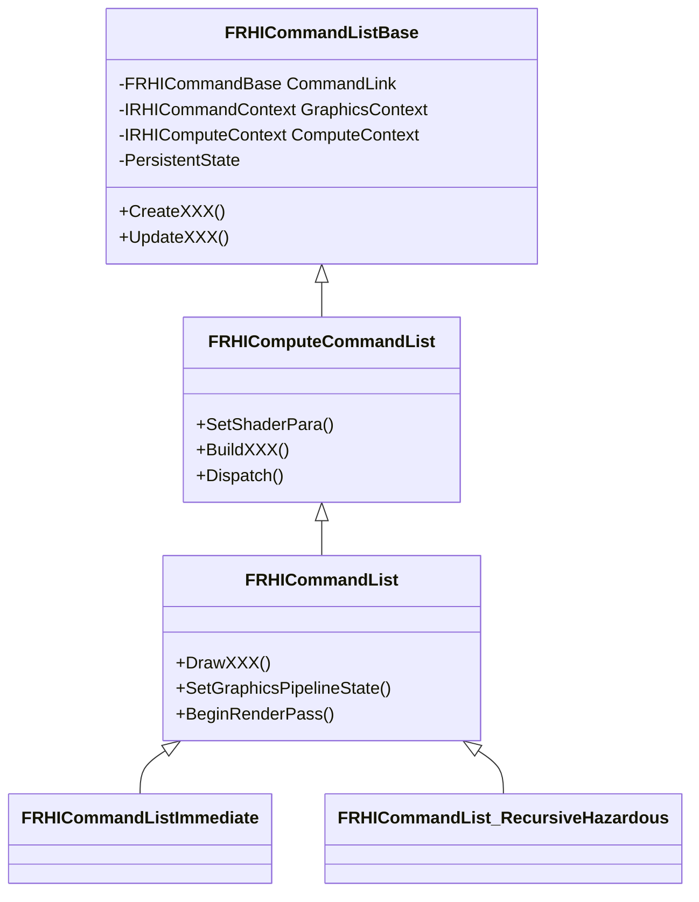

[UE5 渲染剖析_1 - 知乎](https://zhuanlan.zhihu.com/p/718861699)

[UE5 渲染剖析_2 - 知乎](https://zhuanlan.zhihu.com/p/721311258)

### Render Thread 创建运行

- 创建：

  > `EnginePreInit(CmdLine) ->`
  >
  > `FEngineLoop::PreInitPostStartupScreen(CmdLine) -> `
  >
  > `InitRenderingThread() -> `
  >
  > `StartRenderingThread() -> `
  >
  > `[GRenderingThreadRunnable = new FRenderingThread()] -> `
  >
  > `[GRenderingThread = FRunnableThread::Create(GRenderingThreadRunnable...)] -> `
  >
  > `FRunnableThread::SetupCreatedThread(InRunnable=GRenderingThreadRunnable...) -> `
  >
  > `FRunnableThread::CreateInternal() -> `
  >
  > `CreateThread(..., _ThreadProc, this, ...)`
  >
  > 
  >
  > `GRenderingThreadRunnable ` 其实一开始只是一个 Runable 对象，没有与实际的线程关联起来，`[GRenderingThread = FRunnableThread::Create(GRenderingThreadRunnable...)]` 后才与实际线程关联起来。

- 运行：

  - `CreateThread` 创建线程后，会立即执行 `_ThreadProc()`，经过 `[ThisThread->GuardedRun()] -> Run() -> [Runnable->Run()]` 转发后执行到 `GRenderingThreadRunnable->Run()` 中，后续的调用栈为

  > `FRenderingThread::Run() -> `
  >
  > `RenderingThreadMain( TaskGraphBoundSyncEvent ) -> `
  >
  > `FTaskGraphInterface::Get().ProcessThreadUntilRequestReturn(RenderThread) -> `
  >
  > `FNamedTaskThread::ProcessTasksUntilQuit(QueueIndex) -> `
  >
  > `[do_while{ ProcessTasksNamedThread(QueueIndex, bAllowStall) }] ->`
  >
  > `while(!Queue(QueueIndex).QuitForReturn){ Task->Execute() }`

至此就是 Render Thread 的创建和运行流程了，它不断读取 task graph queue 中的task，然后执行 task。这里的 task 主要通过 `ENQUEUE_RENDER_COMMAND(Type)` 来构造并入队。

### RHIThread 创建运行

与 Render Thread 类似，也在 `StartRenderingThread()` 中创建。

> 这一部分代码在 UE5.5 中有改动，见 [Merging //UE5/Dev-ParallelRendering/... (up to CL 30965645) to //UE5/… · EpicGames/UnrealEngine@10cdd4a (github.com)](https://github.com/EpicGames/UnrealEngine/commit/10cdd4a111829b1ec04738249b25dcf929955126)，主要是重构了 RHI 和 RDG 部分，可以并行转换 task。

在 UE5.5 后的版本中，创建流程如下：

> `StartRenderingThread() ->`
>
> `[case ERHIThreadMode::DedicatedThread:] ->`
>
> `[GRHIThread = new FRHIThread()] ->`
>
> `FRunnableThread::Create(this, ...) ->`
>
> `FRunnableThread::SetupCreatedThread(InRunnable=GHIThread, ...) ->`
>
> `FRunnableThread::CreateInternal() -> `
>
> `CreateThread(..., _ThreadProc, this, ...)`

其实流程与 Render Thread 大体一样，只不过要判断 RHI 线程是否要在分离线程中运行。后续创建好之后，调用 `FRHIThread::Run()`，在 `Run()` 中也进入到 TaskGraph 中处理任务：`FTaskGraphInterface::Get().ProcessThreadUntilRequestReturn(ENamedThreads::RHIThread)`。

RenderThread 的 Task 执行时，会拿到 `RHICommandList RHICmdList`，在其中调用各种接口。

### RHICommand 相关

RHICommand 在 UE5 中为 `FRHICommandBase` 实际上是个链表。`TRHILambdaCommand`、`TRHILambdaCommand_NoMarker`、`TRHILambdaCommandMultiPipe` 都继承自它，它们封装了要执行的 Command，通过调用 `ExecuteAndDestruct()` 执行。RHICommand 以链表形式存储在 RHICommandList 中。

RHICommandList 继承关系

`FDynamicRHI` 类是图形库的适配层。DynamicRHI 在各个平台的实现都会继承 `IRHICommandContext` 和 `FDynamicRHI` 相应扩展类，各平台通过各自的 `PlatformCreateDynamicRHI()` 来创建 `FDynamicRHI`。

### RenderCommand

FRenderCommand 是一个更高层次的抽象,通常用于封装渲染逻辑。而FRHICommand 是一个更低层次的抽象，直接与图形API交互，用于封装底层的图形API调用。

`TEnqueueUniqueRenderCommandType` 继承自 `FRenderCommand`，`TagType` 通常为 `TRenderCommandTag` 的特化，以及使用宏 `DECLARE_RENDER_COMMAND_TAG` 申明 `RenderCommandTag` 。核心函数示 `DoTask()`，持有 Lambda 函数。