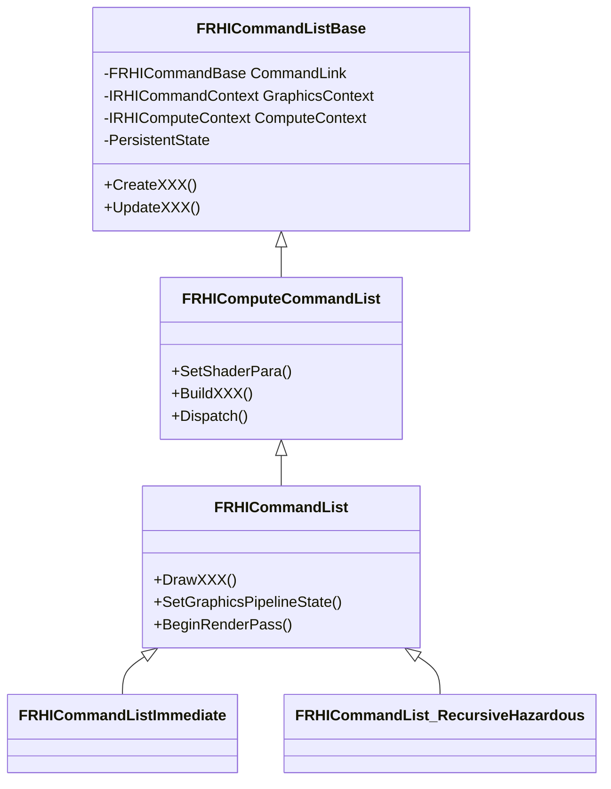

[UE5 渲染剖析_1 - 知乎](https://zhuanlan.zhihu.com/p/718861699)

[UE5 渲染剖析_2 - 知乎](https://zhuanlan.zhihu.com/p/721311258)


[剖析虚幻渲染体系-开篇说明 - 0向往0 - 博客园 (cnblogs.com)](https://www.cnblogs.com/timlly/p/13512787.html)


### Render Thread 创建运行

- 创建：

  > `EnginePreInit(CmdLine) ->`
  >
  > - `FEngineLoop::PreInit() ->`
  >
  >   - `FEngineLoop::PreInitPostStartupScreen(CmdLine) -> `
  >
  >     - `InitRenderingThread() -> `
  >
  >       - `StartRenderingThread() -> `
  >
  >         - `[GRenderingThreadRunnable = new FRenderingThread()] -> `
  >
  >         - `[GRenderingThread = FRunnableThread::Create(GRenderingThreadRunnable...)] -> `
  >
  >           - `FRunnableThread::SetupCreatedThread(InRunnable=GRenderingThreadRunnable...) -> `
  >
  >             - `FRunnableThread::CreateInternal() -> `
  >
  >             - `CreateThread(..., _ThreadProc, this, ...)`
  >
  > 
  >
  > `GRenderingThreadRunnable ` 其实一开始只是一个 Runable 对象，没有与实际的线程关联起来，`[GRenderingThread = FRunnableThread::Create(GRenderingThreadRunnable...)]` 后才与实际线程关联起来。

- 运行：

  - `CreateThread` 创建线程后，会立即执行 `_ThreadProc()`，经过 `[ThisThread->GuardedRun()] -> Run() -> [Runnable->Run()]` 转发后执行到 `GRenderingThreadRunnable->Run()` 中，后续的调用栈为

  > `FRenderingThread::Run() -> `
  >
  > - `RenderingThreadMain( TaskGraphBoundSyncEvent ) -> `
  >  - `FTaskGraphInterface::Get().ProcessThreadUntilRequestReturn(RenderThread) -> `
  >     - `FNamedTaskThread::ProcessTasksUntilQuit(QueueIndex) -> `
  >      - `[do_while{ ProcessTasksNamedThread(QueueIndex, bAllowStall) }] ->`
  >         - `while(!Queue(QueueIndex).QuitForReturn){ Task->Execute() }`
  >
  > 
  >
  > 在 `RenderingThreadMain()` 中，调用 `FTaskGraphInterface::Get().AttachToThread(RenderThread)` 将当前线程绑定到 Task Graph 的 ActualRenderingThread 槽位中。

至此就是 Render Thread 的创建和运行流程了，它不断读取 task graph queue 中的task，然后执行 task。这里的 task 主要通过 `ENQUEUE_RENDER_COMMAND(Type)` 来构造并入队。

### RHIThread 创建运行

是否使用单独线程来运行 RHIThread 通过在实际的 RHI 实现中指示，如在 `VulkanRHI.cpp` 中，就有`RHISupportsRHIThread = GRHIThreadCvar->GetInt() != 0;`。

与 Render Thread 类似，也在 `StartRenderingThread()` 中创建。

> 这一部分代码在 UE5.5 中有改动，见 [Merging //UE5/Dev-ParallelRendering/... (up to CL 30965645) to //UE5/… · EpicGames/UnrealEngine@10cdd4a (github.com)](https://github.com/EpicGames/UnrealEngine/commit/10cdd4a111829b1ec04738249b25dcf929955126)，主要是重构了 RHI 和 RDG 部分，可以并行转换 task。

在 UE5.5 后的版本中，创建流程如下：

> `StartRenderingThread() ->`
>
> - `[case ERHIThreadMode::DedicatedThread:] ->`
>
> - `[GRHIThread = new FRHIThread()] ->`
>
>   - `FRunnableThread::Create(this, ...) ->`
>
>   - `FRunnableThread::SetupCreatedThread(InRunnable=GHIThread, ...) ->`
>    - `FRunnableThread::CreateInternal() -> `
>       - `CreateThread(..., _ThreadProc, this, ...)`

其实流程与 Render Thread 大体一样，只不过要判断 RHI 线程是否要在分离线程中运行。后续创建好之后，调用 `FRHIThread::Run()`，在 `Run()` 中也进入到 TaskGraph 中处理任务：`FTaskGraphInterface::Get().ProcessThreadUntilRequestReturn(ENamedThreads::RHIThread)`。

RenderThread 的 Task 执行时，会拿到 `RHICommandList RHICmdList`，在其中调用各种接口。

> 在 `Run()` 中处理任务之前，使用 `FTaskGraphInterface::Get().AttachToThread(ENamedThreads::RHIThread)` 将当前线程（即 RHI 线程）绑定到 Task Graph 的 RHIThread 槽位中。

### RHICommand 相关

RHICommand 在 UE5 中为 `FRHICommandBase` 实际上是个链表。`TRHILambdaCommand`、`TRHILambdaCommand_NoMarker`、`TRHILambdaCommandMultiPipe` 都继承自它，它们封装了要执行的 Command，通过调用 `ExecuteAndDestruct()` 执行。RHICommand 以链表形式存储在 RHICommandList 中。

RHICommandList 继承关系



`FDynamicRHI` 类是图形库的适配层。DynamicRHI 在各个平台的实现都会继承 `IRHICommandContext` 和 `FDynamicRHI` 相应扩展类，各平台通过各自的 `PlatformCreateDynamicRHI()` 来创建 `FDynamicRHI`。

> 同时在 `RHICommandList.h` 中，有个很重要的宏 `FRHICOMMAND_MACRO`，UE 用它声明了近百种 RHI 指令。渲染线程创建这些声明好的RHI指令即可在合适的被推入RHI线程队列并被执行，使用方法为调用 FRHICommandList 实例的对应命令的接口，如 `RHICmdList.DrawPrimitive` 等，这些接口会分配对应的 RHI 命令。

### RenderCommand

FRenderCommand 是一个更高层次的抽象,通常用于封装渲染逻辑。而FRHICommand 是一个更低层次的抽象，直接与图形API交互，用于封装底层的图形API调用。

通过宏 `ENQUEUE_RENDER_COMMAND` 来入队，其使用方法为 `ENQUEUE_RENDER_COMMAND(CommandType)(lamdaExpression);`，其中 CommandType 是使用者定义的一个类型，它会被生成一个跟此名字相关的独特的 struct，然后通过 `TRenderCommandTag` 包装起来用于 profile；lamdaExpression 是一个 lambda 表达式，为这个 command 需要做的事情。这个宏最终会调用 `FRenderCommandPipe::Enqueue(LambdaType&& Lambda)`。

`FRenderCommandPipe` 可以看做是将 Render Command 放入的管道，如果在使用 `ENQUEUE_RENDER_COMMAND` 时不光指定了 lambda，还指定了特定的 `FRenderCommandPipe`，那么就会将命令放入特定的管道；如果没有指定管道，则会将命令放入默认的 `FRenderThreadCommandPipe `，它是一个单例。

前面的 `FRenderCommandPipe::Enqueue()` 会调用 `EnqueueUniqueRenderCommand(LambdaType&& Lambda)`  来直接运行 lambda 表达式（如果当前线程是渲染线程）；或者将 lambda 添加到 Render Thread 的 TaskQueue 中，此时`EnqueueUniqueRenderCommand(LambdaType&& Lambda)` 又会调用 `FRenderThreadCommandPipe::Enqueue(LambdaType&& Lambda)`。在 `TGraphTask<<>>::CreateTask().ConstructAndDispatchWhenReady()` 中会构建一个 `TEnqueueUniqueRenderCommandType` 的实例。

`TEnqueueUniqueRenderCommandType` 继承自 `FRenderCommand`，`TagType` 通常为 `TRenderCommandTag` 的特化，以及使用宏 `DECLARE_RENDER_COMMAND_TAG` 申明 `RenderCommandTag` 。核心函数示 `DoTask()`，持有 Lambda 函数。

> 后续添加到 TaskQueue 的调用流程大体为：
>
> `FRenderThreadCommandPipe::Enqueue(Lambda) ->`
>
> - `TGraphTask<TEnqueueUniqueRenderCommandType<RenderCommandTag, LambdaType>>::CreateTask().ConstructAndDispatchWhenReady(MoveTemp(Lambda)) ->`
>   - `FConstructor::ConstructAndDispatchWhenReady() ->`
>     - `FConstructor::ConstructAndHoldImpl() ->`
>     - `FTaskBase::TryLaunch() ->`
>       - `FTaskBase::TryUnlock() ->`
>         - `FTaskBase::Schedule() ->`
>           - `[计算应该在哪个线程运行] -> FTaskGraphInterface::Get().QueueTask() ->`
>             - `[获取对应线程的 FTaskThreadBase] -> [Target->EnqueueFromXXXThread(QueueToExecuteOn, Task)] ->`
>               - `FNamedTaskThread::EnqueueFromXXXThread() ->`
>                 - `Queue(QueueIndex).StallQueue.Push(Task, PriIndex)`


`ENQUEUE_RENDER_COMMAND` 宏展开实例：

```c++
// ENQUEUE_RENDER_COMMAND 宏定义
#define ENQUEUE_RENDER_COMMAND(Type) \
	DECLARE_RENDER_COMMAND_TAG(PREPROCESSOR_JOIN(FRenderCommandTag_, PREPROCESSOR_JOIN(Type, __LINE__)), Type) \
	FRenderCommandPipe::Enqueue<PREPROCESSOR_JOIN(FRenderCommandTag_, PREPROCESSOR_JOIN(Type, __LINE__))>


// 某处调用 ENQUEUE_RENDER_COMMAND 宏来将 command 入队
ENQUEUE_RENDER_COMMAND(SlateDrawWindowsCommand)([this, DrawWindowsCommand = MoveTemp(DrawWindowsCommand)](FRHICommandListImmediate& RHICmdList)
{
	DrawWindows_RenderThread(RHICmdList, DrawWindowsCommand->Windows, DrawWindowsCommand->DeferredUpdates);
});


// 宏的部分展开
ENQUEUE_RENDER_COMMAND(SlateDrawWindowsCommand) ->
    DECLARE_RENDER_COMMAND_TAG(FRenderCommandTag_SlateDrawWindowsCommand1373), SlateDrawWindowsCommand)
    FRenderCommandPipe::Enqueue<FRenderCommandTag_SlateDrawWindowsCommand1373>([this, DrawWindowsCommand = MoveTemp(DrawWindowsCommand)](FRHICommandListImmediate& RHICmdList)
{
	DrawWindows_RenderThread(RHICmdList, DrawWindowsCommand->Windows, DrawWindowsCommand->DeferredUpdates);
});


// 宏的完全展开
ENQUEUE_RENDER_COMMAND(SlateDrawWindowsCommand) ->
    struct TSTR_SlateDrawWindowsCommand1373
	{
		static const char* CStr() { return "SlateDrawWindowsCommand"; }
		static const TCHAR* TStr() { return TEXT("SlateDrawWindowsCommand"); }
	};
	using FRenderCommandTag_SlateDrawWindowsCommand1373 = TRenderCommandTag<TSTR_SlateDrawWindowsCommand1373>;

    FRenderCommandPipe::Enqueue<FRenderCommandTag_SlateDrawWindowsCommand1373>([this, DrawWindowsCommand = MoveTemp(DrawWindowsCommand)](FRHICommandListImmediate& RHICmdList)
    {
        DrawWindows_RenderThread(RHICmdList, DrawWindowsCommand->Windows, DrawWindowsCommand->DeferredUpdates);
    });


```

对应的 `TEnqueueUniqueRenderCommandType` 的模板特例化如下：

```cpp
// ConstructAndHoldImpl 中的展开
TTask = TEnqueueUniqueRenderCommandType<RenderCommandTag, LambdaType>
      = TEnqueueUniqueRenderCommandType<FRenderCommandTag_SlateDrawWindowsCommand1373, LambdaType>
```

通过 `TGraphTask<TEnqueueUniqueRenderCommandType<FRenderCommandTag_SlateDrawWindowsCommand1373, LambdaType>>::CreateTask()` 得到一个 `FConstructor`，`FConstructor::ConstructAndDispatchWhenReady()` 中调用 `ConstructAndHoldImpl()`, `ConstructAndHoldImpl()` 中 New 了一个 `TTask`，即`TEnqueueUniqueRenderCommandType<FRenderCommandTag_SlateDrawWindowsCommand1373, LambdaType>` 实例，此实例包装在 `TGraphTask<>` 中，调用 `Init()` 初始化后返回。后续执行 Task 时，调用 `TGraphTask::Execute()` （Execute 函数为基类 `UE::Tasks::Private::FTaskBase` 的纯虚函数，`TGraphTask` 实现了它）来执行刚才 `TEnqueueUniqueRenderCommandType` 实例中的 `DoTask()` 函数。

[【视频资料整理】多线程渲染 Parallel Rendering In UE5 UOD2022\] - 知乎 (zhihu.com)](https://zhuanlan.zhihu.com/p/662225541)

### Task Graph

Task Graph 持有一个线程池，池中分为两大类线程：一类是 Named 线程（有名字的线程），用来做专门的事情，有 GameThread（即主线程）、RenderThread、RHIThread；另一类是普通线程，用来做其他通用的事情，它们的优先级比 Named 线程稍微低一点。在初始化时，GameThread 会绑定到 Task Graph 的 GameThread 槽位，RenderThread 和 RHIThread 会在创建后运行线程实际函数的时候绑定到对应槽位。

在 UE5.5.3 中，`TaskGraphDefinitions.h` 定义了宏 `#define TASKGRAPH_NEW_FRONTEND 1` 用来表示使用新 TaskGraph 前端。先将它改为 0，阅读以前的 task graph 源码。

在 Task Graph 后端这部分，UE5 相对于 UE4 改动不小，可以参考：[UE5 多线程之TaskGraph - 知乎 (zhihu.com)](https://zhuanlan.zhihu.com/p/4993171865)

[UE多线程机制 - Unreal - Piccolo社区 (piccoloengine.com)](https://www.piccoloengine.com/topic/310472)（图来自于[《Exploring in UE4》多线程机制详解](https://zhuanlan.zhihu.com/p/38881269)）。