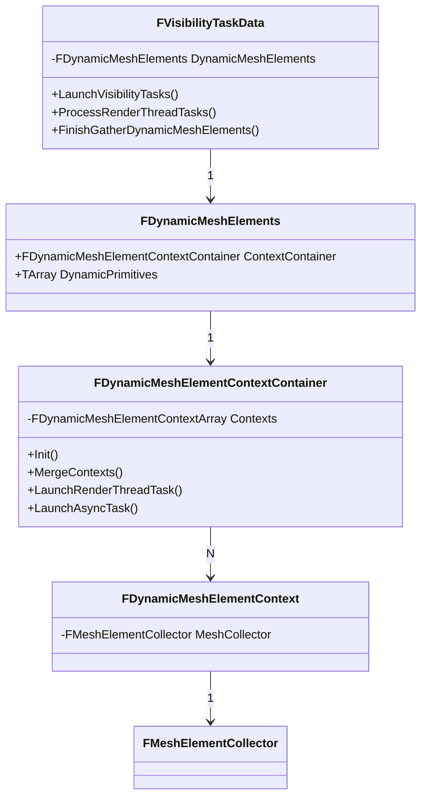

[UE5【理论】2.延迟渲染管线DeferredShadingPipeline - 知乎 (zhihu.com)](https://zhuanlan.zhihu.com/p/574117143)

在 `UE5杂项笔记.md` 中提到，引擎初始化完毕后，会调用`EngineTick()` 来对整个引擎进行 tick 更新引擎的状态，包括绘制场景，更新物体等等，这里的 tick 是引擎的核心部分。我们先看它是如何调用渲染器渲染场景的。

> - `FEngineLoop::Tick() ->` `GEngine->Tick()`
>   - `UUnrealEdEngine/UGameEngine::Tick() ->`
>     - `UEditorEngine::UpdateSingleViewportClient()/UGameEngine::RedrawViewports() ->`
>       - `FViewport::Draw() ->`
>         - `UGameViewportClient/FEditorViewportClient::Draw() ->`
>           - `GetRendererModule().BeginRenderingViewFamily()->`  `GetRendererModule()` 返回一个 `FRendererModule` 的实例
>             - `FSceneRenderer::CreateSceneRenderers() ->`
>               - `new FDeferredShadingSceneRenderer/FMobileSceneRenderer`
>             - `ENQUEUE_RENDER_COMMAND(FDrawSceneCommand) ->` 发送 `FDrawSceneCommand` 命令到渲染线程
>               - 渲染线程中 `RenderViewFamilies_RenderThread() ->`
>                 - `FRDGBuilder GraphBuilder()`：针对每个 SceneRenderer，创建一个 GraphBuilder，用于收集各个 pass，生成 RDG
>                 - **`FDeferredShadingSceneRenderer::RenderHitProxies()/Render()`** 

`RenderViewFamilies_RenderThread()` 中调用了 `SceneRenderer->RenderHitProxies()/Render()`。在最后这里 `Render` 是渲染整个场景的，`RenderHitProxies` 是渲染鼠标点击物体场景的，算是Render的简单版本。

> 关于 HitProxy 知乎上有文：[Learning UE5: HitProxy 原理 - 知乎 (zhihu.com)](https://zhuanlan.zhihu.com/p/670360410)

`SceneRenderer` 是一个 `FSceneRenderer` 的子类的实例。`SceneRendering.h` 与 `SceneRendering.cpp` 中定义了 `FSceneRenderer` 类和它的一个子类 `FMobileSceneRenderer`（用于移动端渲染），`DeferredShadingRenderer.h/cpp` 中定义了另一个子类 `FDeferredShadingSceneRenderer`，用于延迟渲染。后续主要基于延迟渲染分析。

这里分析 `FDeferredShadingSceneRenderer::Render()` 流程（[UE5中的Render函数到底做了什么？ - 知乎 (zhihu.com)](https://zhuanlan.zhihu.com/p/642093164)）。

###  `FDeferredShadingSceneRenderer::Render()`

> [UE5【理论】2.延迟渲染管线DeferredShadingPipeline - 知乎 (zhihu.com)](https://zhuanlan.zhihu.com/p/574117143)
>
> 在 UE5.3 中，重构了 `Render()` 函数，将其中的第一步流程 `Scene->UpdateAllPrimitiveSceneInfos()` 工作包装成了一个 task，随后又经过了多次修改。主要的有：
>
> 1. [Commit 7173e0f](https://github.com/EpicGames/UnrealEngine/commit/7173e0f8fda45d874f91871e7bf1c8cb78317e71) 将 Render 函数中的 `Scene->UpdateAllPrimitiveSceneInfos()` 工作放入了新建的 `FSceneRenderer::UpdateScene()` 中
> 2. [Commit b9494a7](https://github.com/EpicGames/UnrealEngine/commit/b9494a7040175a19a2464c1db9552848b33774d5) 在 `FSceneRenderer::UpdateScene()` 将图元剔除放入异步task中（`BeginInitVisibility()`）
> 3. [Commit 9cd7556](https://github.com/EpicGames/UnrealEngine/commit/9cd755694f97946ad0e84806250d9fdf428cefc7) 将 InitView 重构为 TaskGraph，表现为 `FSceneRenderer::UpdateScene()` 中的 `BeginInitVisibility()` 变为 `LaunchVisibilityTasks()`
> 4. [Commit 7c7cff1 ](https://github.com/EpicGames/UnrealEngine/commit/7c7cff174ab43224090c54b36c7562248bf3d8ac) 将 `FSceneRenderer::UpdateScene()` 又重构成了 `FSceneRenderer::OnRenderBegin()`，将 `Scene->UpdateAllPrimitiveSceneInfos()` 放在 Landscape 和其他扩展调用及  `LaunchVisibilityTasks()` 之前。PS：此时将 `RenderFinish` 也改成了 `OnRenderFinish`，此时 RenderBegin 和 RenderFinish 可以都看作是事件 Task。
> 5. [Commit 99b678a](https://github.com/EpicGames/UnrealEngine/commit/99b678aba2cb915c1c25e325c29ba234e8625fd0) 将 View-Independent GPU Scene 更新移到 initViews 之前，以减少关键路径。即将 `Scene->GPUScene.Update()` 从 `Render()` 中移动到了 `FDeferredShadingSceneRenderer::BeginInitViews()` 中
> 6. [Commit cbb08f4](https://github.com/EpicGames/UnrealEngine/commit/cbb08f4609d3ed868bde227f44d22e3aec580551) 又将 `GPUScene.Update()` 从 `BeginInitViews` 中移至 `UpdateAllPrimitiveSceneInfos` 的末尾，以便为与 GPU-scene 交互的子系统提供更高效、一致的场景更新。
> 7. [Commit 04d2b65](https://github.com/EpicGames/UnrealEngine/commit/04d2b6543a9241546756a9da52f1df706248c46d) 致力于通过 GPU 场景更新解决可见性重叠问题。这里在 `FScene` 中添加了一个 `Update()` 函数，用于同步或异步更新场景，其逻辑与 `FScene::UpdateAllPrimitiveSceneInfos()` 基本一致。而 `FScene::UpdateAllPrimitiveSceneInfos()` 算是 `Update()` 的特化同步版本，直接使用默认的同步参数调用 `Update()` 函数，同时无回调函数。以前版本的 `UpdateAllPrimitiveSceneInfos()` 可以在 [RendererScene.cpp_commit_56d764b](https://github.com/EpicGames/UnrealEngine/blob/56d764b0e71cddb66fdbb5dfc47f81de61c19465/Engine/Source/Runtime/Renderer/Private/RendererScene.cpp#L5416C1-L6666C2) 中找到。`OnRenderBegin()` 中将原本 `UpdateAllPrimitiveSceneInfos()` 之后的一些处理，如  Landscape 和其他扩展调用及  `LaunchVisibilityTasks()` 包装成 SceneUpdateParameters 中的回调函数，将 SceneUpdateParameters 传递给 `FScene::Update()` 函数。在 `Update` 函数中处理完原本 `UpdateAllPrimitiveSceneInfos()` 的逻辑后，调用回调函数，同时将 VisibilityTaskData 以 Lambda 捕获的方式传递回 `OnRenderBegin()`。

根据 `RDG_EVENT_SCOPE_STAT` 宏，可以将整个渲染流程分为几个大块。

一是设置场景、收集更新数据：

1. `FSceneRenderer::OnRenderBegin()`：进行渲染前更新
   1. 准备 `EUpdateAllPrimitiveSceneInfosAsyncOps` flag
   2. 准备 `FScene::FUpdateParameters SceneUpdateParameters` 参数：设置回调函数给它的 `Callbacks.PostStaticMeshUpdate`，回调函数中调用如下：
      1. `RayTracing::OnRenderBegin()`：更新光追相关的资源和 view
      2. `ViewFamily.ViewExtensions[ViewExt]->PreRenderViewFamily_RenderThread()`：针对每个ViewExtension，更新其ViewFamily
      3. `PrepareViewRectsForRendering()`：准备viewRect和viewState，设置最终渲染的View区域
      4.  `LaunchVisibilityTasks()` 启动了任务进行可见性判断，将返回的 `FVisibilityTaskData VisibilityTaskData` 通过捕获的方式传出到 `OnRenderBegin()`，再返回给 `Render()`。执行视锥体剔除Frustum Cull、遮挡剔除Occlusion Cull、相关性计算Compute Relevance
         1. 收集动态网格元素
         2. 设置 Mesh Passes
   3. `FScene::Update()`：使用 `SceneUpdateParameters` 参数调用当前场景的 `Update()` 函数，更新场景。这里的 `FScene::Update()` 函数与文章中的 `FScene::UpdateAllPrimitiveSceneInfos()` 函数流程基本一样，不过在最后会运行 `PostStaticMeshUpdate` 回调函数。
      1. `GPUSkinCache->DoDispatch()`：如果有 GPU 蒙皮，调用 GPU 更新它
      2. `RDG_EVENT_SCOPE(GraphBuilder, "UpdateAllPrimitiveSceneInfos")`：标志着图元场景信息开始更新了
      3. `SceneUpdateChangeSetStorage.PrimitiveUpdates.ForEachCommand(Lambda)`：获取场景更新中常用的类别。
      4. `UpdateAllLightSceneInfos()` 更新光照信息
      5. `UpdateRayTracingGroupBounds_XXX()`：更新光追组绑定
      6. `GPUScene.OnPreSceneUpdate()`：根据GPUScene中的 `PrimitiveUpdates` 中的command，更新图元的Dirty状态
      7. `SceneCulling->BeginUpdate()`：进行 SceneCulling 更新，会向RDG中添加 ComputeExplicitCellBounds Pass，然后根据计算结果调用一个task用来标记需要剔除的instance
      8. `SceneExtensionsUpdaters.PreSceneUpdate()`：针对 Extensions 进行更新
      9. `SCOPED_NAMED_EVENT(FScene_RemovePrimitiveSceneInfos, FColor::Red)`：移除不需要的PrimitiveSceneInfo。将要删除对象移动到该类型的末端，直到到达末尾
      10. `SCOPED_NAMED_EVENT(FScene_UpdatePrimitiveInstances, FColor::Emerald)`：在将primitive添加之前，释放其instance
      11. `CSV_SCOPED_TIMING_STAT_EXCLUSIVE(AddPrimitiveSceneInfos);SCOPED_NAMED_EVENT(FScene_AddPrimitiveSceneInfos, FColor::Green)`：将primitive添加进场景中的结构体以及RDG中分配的内存结构体
      12. `CSV_SCOPED_TIMING_STAT_EXCLUSIVE(UpdatePrimitiveTransform);SCOPED_NAMED_EVENT(FScene_AddPrimitiveSceneInfos, FColor::Yellow)`：更新primitve对应的Transform信息
      13. `SCOPED_NAMED_EVENT(FScene_UpdatePrimitiveInstances, FColor::Emerald)`：更新primitive instance。
      14. `UpdateRayTracingGroupBounds_UpdatePrimitives(UpdatedInstances)`：根据要更新的transform信息更新光追Group。
      15. `FPrimitiveSceneInfo::AddToScene(this, SceneInfosWithAddToScene)`：将更新后的PrimitiveSceneInfos添加进场景中，其中进行了很多光照信息的更新、碰撞盒信息的添加
      16. `GPUScene.Update()`：更新GPU场景资源，从场景中提取所有待处理的更新并上传原始数据和实例数据。
      17. `SceneCullingUpdater.OnPostSceneUpdate()`：根据场景更新后的信息，处理cull后的结果
      18. `GPUScene.OnPostSceneUpdate()`：根据添加的primitive，更新对应GPU状态
      19. `SceneExtensionsUpdaters.PostSceneUpdate()`：针对 Extensions 进行更新后处理
      20. `AddStaticMeshesTask = GraphBuilder.AddCommandListSetupTask(lambda)`：添加静态网格
      21. `UpdateReflectionSceneData(this)`：更新反射捕获
      22. `SCOPED_NAMED_EVENT(UpdateStaticMeshes, FColor::Emerald)`：更新静态网格。
      23. `Parameters.Callbacks.PostStaticMeshUpdate(AddStaticMeshesTask)`：调用步骤1.2中的回调函数，设置渲染区域、进行可见性判断等等。
      24. `GPUScene.AddPrimitiveToUpdate()`：将需要更新的图元在GPUScene中标记为dirty
      25. `GraphBuilder.AddCommandListSetupTask([]{Proxy->UpdateUniformBuffer(RHICmdList)})`：设置更新uniform buffer任务。
      26. `GPUScene.Update()`：从场景中提取所有待处理的更新并上传原始数据和实例数据。
      27. `GraphBuilder.AddSetupTask()`：在渲染线程上移除被标记为deleted的PrimitiveSceneInfo。
2. `FGPUSceneScopeBeginEndHelper GPUSceneScopeBeginEndHelper(GraphBuilder, Scene->GPUScene, GPUSceneDynamicContext)`：在此处调用 `GPUScene.BeginRender(GraphBuilder, GPUSceneDynamicContext)`，在 `Render()` 结尾调用 `GPUScene.EndRender()`
   1. `FGPUScene::BeginRender()`： GPU-Scene 记录场景图元数量，并为动态primitive分配做好准备。
3. `VirtualTextureUpdater = FVirtualTextureSystem::Get().BeginUpdate()`：开始更新VirtualTexture，这里主要是资源的分配
4. `CommitFinalPipelineState()`：计算并提交渲染器整个依赖拓扑的最终状态。
   1. `CommitIndirectLightingState()`：提交关于间接光照的所有管线状态。判断间接Diffuse、AO、Reflection、ReflectionMethodWater 等是否使用lumen
   2. 设置 HZB 状态
   3. `{GetViewPipelineStateWritable(View).Commit()}; FamilyPipelineState.Commit()`：针对每个 view，提交pipeline state
5. `GSystemTextures.InitializeTextures(GraphBuilder.RHICmdList, FeatureLevel)`：初始化 Global RenderTarget，创建纯色贴图
6. `LaunchSceneRenderTask([]{UpdateLightFunctionAtlasTaskFunction()})`：将所有灯光注册到灯光功能图集并进行更新。
7. `PrepareSunLightProxy()`：更新天空大气，在启动 Lumen 场景照明之前完成
8. `BeginUpdateLumenSceneTasks(); BeginGatherLumenLights()`：更新lumen场景
9. `ShaderPrint::BeginViews(GraphBuilder, Views)`：从现在开始初始化ShaderPrint。
10. `ShadowScene.UpdateForRenderedFrame(GraphBuilder)`：处理阴影场景更新
11. `InitializeRayTracingFlags_RenderThread()`：初始化 ray tracing 标志位
12. `RayTracing::BeginGatherInstances()`：开始收集Instance任务，任务中调用`GatherRelevantStaticPrimitives()`
13. Nanite 相关
14. `ComputeGPUMasks()`：Multi GPU相关设置
15. `const FRDGSystemTextures& SystemTextures = FRDGSystemTextures::Create(GraphBuilder)`：在RDG中创建系统贴图，将 GSystemTextures 中的纯色贴图注册给系统贴图
16. `FSceneTextures::InitializeViewFamily(GraphBuilder, ViewFamily, FamilySize)`：初始化 viewFamily 中的 贴图。
17. `BeginInitViews(GraphBuilder, SceneTexturesConfig, InstanceCullingManager, ExternalAccessQueue, InitViewTaskDatas)`：开始初始化视图
    1. `PreVisibilityFrameSetup(GraphBuilder)`：在决定可见性之前，执行一些每帧都要执行的设置操作，如FXSystem的更新、光追场景的View矩阵更新、viewExtensions的每帧设置
    2. `TaskDatas.VisibilityTaskData->StartGatherDynamicMeshElements()`：处理等待动态网格可见性任务
    3. `BeginInitDynamicShadows`：根据可见性结果初始化动态阴影
    4. 为instance cull创建 GPU Scene表示
    5. `InitSkyAtmosphereForViews`：初始化天空大气的对应视图资源
    6. `View.InitRHIResources()`：初始化 view 的RHI资源
    7. `TaskDatas.VisibilityTaskData->ProcessRenderThreadTasks()`：等待 Visibility 任务完成
       1. **`GatherDynamicMeshElements(*DynamicMeshElements.PrimitiveViewMasks)`**：收集当前场景所有的FPrimitiveSceneProxy
18. 光追拉花、光追shader、光追光源相关
19. `InitViewTaskDatas.VisibilityTaskData->FinishGatherDynamicMeshElements()`：完成动态网格可见性任务，调用MeshPassSetup任务
    1. `Tasks.MeshPassSetup = UE::Tasks::Launch([]{SetupMeshPasses()})`：设置MeshPassSetup任务。
       1. **`FSceneRenderer::SetupMeshPass()`**：设置MeshPass
          1. 遍历`EMeshPass`定义的所有Pass。
          2. `MeshPassProcessor = FPassProcessorManager::CreateMeshPassProcessor()`：创建 `FMeshPassProcessor`
          3. `Pass = View.ParallelMeshDrawCommandPasses[PassIndex]`：获取指定Pass的`FParallelMeshDrawCommandPass` 对象。
          4. `Pass.DispatchPassSetup(...)`：并行地处理可见Pass的处理任务，创建此Pass的所有绘制命令。
20. `FXSystem->PreRender()`：特效的预渲染，包括GPU粒子、Niagara等等
21. `Scene->GPUScene.UploadDynamicPrimitiveShaderDataForView()`：从 `View.DynamicPrimitiveCollector` 中上传图元
22. `InstanceCullingManager.BeginDeferredCulling()`：使用 compute shader进行实例裁剪，等待 DynamicMesh 添加完成后，开始裁剪pass。
23. `Scene->UpdatePhysicsField(GraphBuilder, View)`：更新物理场
24. `FVirtualTextureSystem::Get().EndUpdate()`：再一次更新 VirtualTexture，这回是对数据进行更新
25. `RayTracing::FinishGatherInstances()`：填充指定视图的 RayTracingScene 实例列表，并将相关的光线追踪数据添加到视图。不会重置先前的场景内容。
26. `GatherAndSortLightsTask = LaunchSceneRenderTask([]{GatherAndSortLights()})`：启动收集并排序光源task。

二是预渲染部分：

1. `GetSceneExtensionsRenderers().PreRender(GraphBuilder)`：调用扩展渲染器的预渲染函数
2. `GEngine->GetPreRenderDelegateEx().Broadcast(GraphBuilder)`：广播预渲染事件
3. `EndInitViews()`：结束视图初始化
   1. `TaskDatas.VisibilityTaskData->Finish()`：等待可见性任务都完成
   2. `UpdatePrimitiveIndirectLightingCacheBuffers()`：更新间接光照buffer
   3. `SetupSceneReflectionCaptureBuffer(RHICmdList)`：设置反射捕获buffer
4. `Substrate::InitialiseSubstrateFrameSceneData()`：初始化Substrate材质系统的帧场景数据
5. `UE::SVT::GetStreamingManager().EndAsyncUpdate()`：等待流加载完成
6. 设置毛发相关的 Bookmark
7. `RenderWaterInfoTexture()`：添加pass，渲染水体信息贴图
8. `RenderPrepassAndVelocity()`：一个lambda函数，包装了 RenderPrePass 等pass
9. `AddClearDepthStencilPass()`：添加 ClearDepthStencil Pass
10. `RenderPrePass(GraphBuilder, InViews, SceneTextures.Depth.Target, InstanceCullingManager, &FirstStageDepthBuffer)`：添加 RenderPrePass，此pass是为了以低成本获得场景的深度图，见[UE5渲染管线--PrePass通道 - 知乎 (zhihu.com)](https://zhuanlan.zhihu.com/p/616968106)
    1. `SetupDepthPassState(DrawRenderState)`：设置 `DrawRenderState` 的 Blend、DepthStencil 状态
    2. `View.BeginRenderView()`：
    3. `View.ParallelMeshDrawCommandPasses[DepthMeshPass].BuildRenderingCommands()`：在每个 View 的 `ParallelMeshDrawCommandPasses` 中提取出对应于DepthMeshPass的CommandPass，收集 cull 结果，合并batch，创建出 Rendering 指令
    4. `GraphBuilder.AddDispatchPass()`：添加 DepthPassParallel pass，在其中调用对应的CommandPass的 **`FParallelMeshDrawCommandPass::Dispatch()`** 函数
       1. `Dispatch([]{FSceneRenderer::SetStereoViewport()})`：以 `SetStereoViewport()` 为 lambda 函数，进行 Dispatch
          1. `OverrideArgs = GetMeshDrawCommandOverrideArgs(*InstanceCullingDrawParams)`：获取绘制所需的 `FMeshDrawCommandOverrideArgs` 命令参数
          2. `RHICmdList = DispatchPassBuilder.CreateCommandList()`：创建 RHICmdList 并 `BeginRenderPass()`
          3. `SetupCommandListFunction()`：运行传入的 lambda 函数，即 `SetStereoViewport()`，设置viewport
          4. `TGraphTask<FDrawVisibleMeshCommandsAnyThreadTask>::CreateTask(&Prereqs).ConstructAndDispatchWhenReady()`：创建 `FDrawVisibleMeshCommandsAnyThreadTask` 绘制任务并运行，主要是为了并行绘制
             1. `FDrawVisibleMeshCommandsAnyThreadTask::DoTask()`：运行并行绘制任务
                1. `InstanceCullingContext.SubmitDrawCommands()`：根据cull的结果，提交绘制命令
                   1. `FMeshDrawCommand::SubmitDraw()`：提交绘制指令到 RHI CommandList 中
                      1. `SubmitDrawBegin()`：设置RenderTarget、State Cache等
                      2. `SubmitDrawEnd()`：提交绘制指令
                         1. **`RHICmdList.DrawIndexedPrimitive()`**
                   2. `FMeshDrawCommand::SubmitDrawEnd()`：如果被分为多个batch，就多次调用此函数提交绘制指令
                2. `RHICmdList.EndRenderPass(); RHICmdList.FinishRecording()` ：结束此RenderPass
    5. `RenderPrePassEditorPrimitives()`：添加 `EditorPrimitives` pass，绘制编辑器图元，在其中调用了 **`FSimpleElementCollector`** 的 `DrawBatchedElements()` 再调用 **`FBatchedElements::Draw()`** 来生成 draw call。
11. `RenderVelocities(.., EVelocityPass::Opaque, ..)`：添加VelocityParallel/Velocity pass 来渲染不透明移动物体的 velocity 图。
12. `RenderNanite()`：等待nanite任务
13. `AddResolveSceneDepthPass()`：添加解析 Depth 的Pass，这个Pass只会在启用MSAA的情况下执行
14. `GVRSImageManager.PrepareImageBasedVRS()`：准备VRS相关资源
15. `FinishInitDynamicShadows()`：设置动态阴影数据
    1. `FSceneRenderer::FinishInitDynamicShadows()`：
       1. `ShadowSceneRenderer->DispatchVirtualShadowMapViewAndCullingSetup()`
          1. `SceneInstanceCullingQuery->Dispatch()`：
16. `FroxelRenderer = RenderOcclusionLambda()`：调用 lambda 函数，执行流程与创建 `Froxel::FRenderer`
    1. 创建 `Froxel::FRenderer`
    2. `RenderOcclusion()`：进行遮挡剔除，HZB。
       1. `GraphBuilder.AddPass([]{BeginOcclusionTests()})`：添加遮挡测试pass
       2. `bUseHzbOcclusion = RenderHzb()`：添加几个 compute pass，用来实现 Hierarchical Z-Buffer Occlusion Culling
    3. `CompositionLighting.ProcessAfterOcclusion(GraphBuilder)`：遮挡剔除后的光照计算
17. `ViewExtension->PreRenderBasePass_RenderThread()`：运行每个 view Extension 的 PreRenderBasePass，进行BasePass前的准备工作
18. `ComputeLightGridOutput = GatherLightsAndComputeLightGrid()`：在当前视图中为每个视图构建一个灯光列表和网格。
19. `InitVolumetricCloudsForViews()`：为每个 view 初始化体积云参数
20. `BeginAsyncDistanceFieldShadowProjections()`：距离场阴影投影计算
21. `InitLocalFogVolumesForViews(); InitVolumetricRenderTargetForViews()`：体积雾相关初始化
22. `RenderSkyAtmosphereLookUpTables()`：生成天空大气LUT表
23. `Scene->AllocateAndCaptureFrameSkyEnvMap()`：实时环境反射
24. `RenderCustomDepthPass()`：自定义深度计算
25. `UpdateLumenScene()`：Lumen场景更新，主要包括光照贴图的渲染等
26. `DispatchRayTracingWorldUpdates()`：异步执行 raytracing 加速结构的创建
27. `SetupRayTracingLightDataForViews()`：设置用于 raytracing 的光源数据
28. `WaitForRayTracingScene()`：如果打开了硬件光追阴影，此时 lumen 场景的光照需要光追场景的结果

三是**开始渲染**：

1. `BeginGatheringLumenSurfaceCacheFeedback(); RenderLumenSceneLighting()`：收集 lumen 的 surface cache，渲染 lumen 光照，其中 lumen 的渲染分为直接光照和计算辐射度两个部分。
2. **`RenderBasePass()`**：延迟渲染中的集合通道，渲染不透明物体的法线，深度，颜色，AO，粗糙度金属度等集合信息，并且写入若干张GBuffer中。
   1. `GraphBuilder.AddPass(RDG_EVENT_NAME("GBufferClear"), ...)`：添加 GBufferClear Pass
   2. `RenderBasePassInternal()`：实际的 BasePass 渲染函数。
      1. `SetupBasePassState()`：设置 BasePass 的Blend 和 DepthStencil 状态
      2. **`GraphBuilder.AddDispatchPass([]{View.ParallelMeshDrawCommandPasses[EMeshPass::BasePass].Dispatch(DispatchPassBuilder, &PassParameters->InstanceCullingDrawParams)})`**：使用 RDG 并行执行BasePass。
      3. `RenderEditorPrimitives()`：渲染编辑器相关的图元
      4. `View.ParallelMeshDrawCommandPasses[EMeshPass::SkyPass].BuildRenderingCommands()` 与 `View.ParallelMeshDrawCommandPasses[EMeshPass::SkyPass].Dispatch()`：并行执行 SkyPass 来渲染大气天空
   3. `RenderAnisotropyPass()`：并行执行 AnisotropyPass
3. `ExtractNormalsForNextFrameReprojection()`：提取法线，为下一帧的重投影准备数据
4. `GraphBuilder.FlushSetupQueue()`：RDG flush Setup队列，执行所有的 Setup 步骤
5. `DispatchAsyncLumenIndirectLightingWork()`：如果开启了异步 lumen 间接光照，则异步执行 lumen 间接光照
6. `RenderShadowDepthMaps()`：渲染 ShadowDetphMaps
7. `AddResolveSceneDepthPass()`：如果开启了msaa，则需要添加解析深度图的pass
8. `CompositionLighting.ProcessAfterBasePass()`：在 BasePass 后添加一些可能影响光照的pass，如贴花等
9. `GraphBuilder.FlushSetupQueue()`：再次 flush setup 队列，为渲染光照部分做准备。
10. 开始光照部分
11. `RenderDiffuseIndirectAndAmbientOcclusion`：渲染 view 中的间接漫反射和 AO
    1. `DenoiserOutputs = RenderLumenFinalGather()`：收集 lumen 的探针，计算 Lumen Translucency GI Volume
    2. `RenderLumenReflections()`：计算 Lumen 反射
    3. `ApplyDiffuseIndirect()`：计算间接漫反射
12. `RenderDFAOAsIndirectShadowing()`：DFAO间接阴影
13. `RenderLights()`：渲染直接光照
    1. 首先如果启用了 EngineShowFlags.DirectLighting 并且支持体积纹理渲染，则收集所有的光照注入数据，然后将它们注入到各个 view 中
    2. `UnbatchedLightsPass()`：两段式处理，进行光照渲染，如果启用了头发光照，会加上对每个视图进行处理，渲染头发的光照。
       1. `RenderRayTracingShadows()`：渲染光追阴影
       2. `RenderLight()`：光照计算，针对每个光源，进行光照计算
          1. `InternalRenderLight()`：实际的光照计算。根据光源类型不同进行不同的光照计算
       3. `RenderLightForHair()`：处理头发的光照渲染
14. `RenderDiffuseIndirectAndAmbientOcclusion()`：再次调用此函数以进行间接漫反射光照合成
15. `RenderDeferredReflectionsAndSkyLighting()`：渲染仅对不透明像素起作用的漫射天空照明和反射
16. `AddSubsurfacePass()`：渲染次表面散射
17. `Substrate::AddSubstrateOpaqueRoughRefractionPasses()`：添加 substrate opaque rough refraction pass
18. `RenderHairStrandsSceneColorScattering()`：渲染头发的散射
19. `ComputeVolumetricFog()`：计算体积雾
20. `RenderVolumetricCloud()`：渲染体积云
21. `RenderLigthShaftSkyFogAndCloud()`：渲染光束、天空大气、雾
22. `RenderOpaqueFX()`：渲染不透明特效
    1. `FXSystem->PostRenderOpaque()`：通知特效系统已经渲染完了
    2. `GPUSortManager->OnPostRenderOpaque()`：GPU粒子渲染完的回调。
23. `RenderHairComposition()`：在透明物体之前，头发的合成
24. `RDG_EVENT_SCOPE(GraphBuilder, "Translucency")`：绘制透明部分
25. `OIT::AddSortTrianglesPass()`：对三角形进行排序
26. `RenderTranslucency()`：渲染那些材质标识为透明的物体
    1. `RenderTranslucencyInner()`：
       1. `RenderTranslucencyViewInner()`：实际的渲染函数，渲染各个 view 中的透明物体
27. `RenderHairComposition()`：在透明物体之后，头发的合成
28. `RenderDistortion()`：Distortion的渲染
29. `RenderVelocities(.., EVelocityPass::Translucent, ..)`：透明物体的velocity
30. `RenderLightShaftBloom()`：渲染光束泛光
31. `RendererModule.RenderOverlayExtensions()`：
32. `RenderDistanceFieldLighting()`：渲染距离场AO
33. `RenderLumenMiscVisualizations()`：根据需要渲染 lumen 的一些可视化项目
34. `CompositeHeterogeneousVolumes()`：
35. `AddResolveSceneColorPass()`：如果开启 MSAA，则添加解析pass
36. `ViewFamily.ViewExtensions[ViewExt]->PrePostProcessPass_RenderThread()`：
37. `AddPostProcessingPasses()`：执行默认的后处理
    1. `AddTemporalSuperResolutionPasses()/AddGen4MainTemporalAAPasses()`：TSR或TAA
    2. `AddLocalExposureBlurredLogLuminancePass()`：局部曝光
       1. `AddGaussianBlurPass()`：添加高斯模糊 Pass
    3. `AddHistogramEyeAdaptationPass()`：添加眼部适应自动曝光 Pass
    4. `AddGaussianBloomPasses()`：高斯泛光
    5. `AddLensFlaresPass()`：镜头光晕
    6. `AddCombineLUTPass()`：合并 LUT
    7. `AddTonemapPass()`：Tonemap
    8. `AddAfterPass()`：
    9. 根据一些配置，添加用于 debug 的 Pass
38. `GEngine->GetPostRenderDelegateEx().Broadcast(GraphBuilder)`：执行注册的后处理代理函数
39. `GetSceneExtensionsRenderers().PostRender()`：执行扩展渲染器的后渲染函数
40. `OnRenderFinish(GraphBuilder, ViewFamilyTexture)`：结束 viewFamily 的渲染
41. `GraphBuilder.AddDispatchHint()`：标记最后一个 Pass 的 `bDispatchAfterExecute` 标志
42. `GraphBuilder.FlushSetupQueue()`：flush setup queue，异步执行之前添加的 setup 步骤
43. `QueueSceneTextureExtractions()`：将场景纹理提取到 global extraction 实例中
44. 进行一些参数的清理工作

此时 `Render()` 函数就执行完毕了，该有的 Pass 都放入了 GraphBuilder 中。

之后执行 **`GraphBuilder.Execute()`** 来执行 RDG，相关内容后续再记录。

> [UE5中的Render函数到底做了什么？ - 知乎 (zhihu.com)](https://zhuanlan.zhihu.com/p/642093164)
>
> [UE5渲染前数据准备 - 知乎 (zhihu.com)](https://www.zhihu.com/column/c_1623021177307365376)
>
> [Unreal 渲染管线原理机制源码剖析 - 知乎 (zhihu.com)](https://zhuanlan.zhihu.com/p/641367884)
>
> [UE4 主渲染函数 - Papalqi](https://papalqi.cn/deferredshaderingrender/)

## 一些改变

### 从FPrimitiveSceneProx到FMeshBatch

与 [从FPrimitiveSceneProx到FMeshBatch](https://www.cnblogs.com/timlly/p/14588598.html#322-%E4%BB%8Efprimitivesceneproxy%E5%88%B0fmeshbatch) 相比，UE5 改动挺大，没有了 `FDeferredShadingSceneRenderer::InitViews()` 函数，并且也没有了 `FSceneRender::ComputeViewVisibility()` 函数，取而代之的是 `FDeferredShadingSceneRenderer::BeginInitViews()`，以及将可见性判断做成并行任务的 `TaskDatas.VisibilityTaskData->ProcessRenderThreadTasks()`。

在 `FVisibilityTaskData` 中，有一个数据结构 `FDynamicMeshElements DynamicMeshElements`，用于收集 DynamicPrimitives，其中又有一个 `FDynamicMeshElementContexContainer ContextContainer`，这个 Container 中又有一个数组 `FDynamicMeshElementContextArray Contexts`，数组中是 `DynamicMeshElementContext` 类型，每个 Context 中又有一个 `FMeshElementCollector MeshCollector` 用于收集 `FPrimitiveSceneProxy`。

收集的大概流程是：

1.  在 `FSceneRenderer::OnRenderBegin()` 中调用 `LaunchVisibilityTasks()` 
   1. 在 `FVisibilityTaskData::LaunchVisibilityTasks()` 中、（调用 `FDynamicMeshElementContextContainer::Init()`）
      1. 创建 `DynamicMeshElements` 中的数据，如 `CommandPipe`（给它设置 CommandFunction）
      2. 初始化 `ContextContainer`，调用 `FDynamicMeshElementContextContainer::Init()` 中创建了 `GNumDynamicMeshElementTasks` 数目个 **`FDynamicMeshElementContext`**，在它们的构造函数中，调用流程如下：
         1. 将 Scene 中具有相同 viewFamily 的 view 放在同一组，不同的放在不同组，调用 `MeshCollector.Start()` 给 Collector 设置 VertexBuffer 和 IndexBuffer。
         2. 针对 ViewMeshArraysPerView 和对应的 view，调用 `MeshCollector.AddViewMeshArrays()` 来将 view 中的 Mesh 信息添加进 Collector 中（？？？此处不理解）
      3. 设置 `FVisibilityTaskData::Tasks` 中各个 FTask 的依赖关系，依赖关系如图所示。
2. 或者在 `FSceneRenderer::BeginInitViews()` 中调用 `LaunchVisibilityTasks::ProcessRenderThreadTasks()`
3. 步骤 1 和 2 都会调用到 `FVisibilityTaskData::GatherDynamicMeshElements()` 中，在此函数中，针对每一个 `FDynamicMeshElementContext` 都调用 `Tasks.DynamicMeshElements.AddPrerequisites(DynamicMeshElements.ContextContainer.LaunchAsyncTask(Queue, Index, TaskConfig.TaskPriority))`，它的含义是给 `DynamicMeshElements` 任务**添加依赖**，此依赖是由 `DynamicMeshElements.ContextContainer.LaunchAsyncTask(Queue, Index, TaskConfig.TaskPriority)` 生成的 Task。
4. 而 `FDynamicMeshElementContextContainer::LaunchAsyncTask()` 又会调用 `FDynamicMeshElementContext::LaunchAsyncTask()`，这里 Context 可能会有多个，所以生成的被依赖的 Task 会有多个
   1. `FDynamicMeshElementContext::LaunchAsyncTask()` 会调用 `Pipe.Launch([]{})` 启动一个任务，任务中会将 PrimitiveIndexQueue 中的 PrimitiveIndex Pop 出来，对于这些 Index 调用 `GatherDynamicMeshElementsForPrimitive()`，用来收集 Primitive
      1. 在 **`FDynamicMeshElementContext::GatherDynamicMeshElementsForPrimitive()`** 中
         1. 调用 `MeshCollector.SetPrimitive()` 将 `FPrimitiveSceneProxy` 的信息设置到收集器中
         2. 调用 **`Primitive->Proxy->GetDynamicMeshElements(FirstViewFamily.AllViews, *Group.Family, MaskedViewMask, MeshCollector)`** 来获取动态网格数据。这里的 Proxy 是 `FPrimitiveSceneProxy` 的子类，如 `FLineBatcherSceneProxy`、`FStaticMeshSceneProxy`、`FSkeletalMeshSceneProxy` 等，他们都实现了 `GetDynamicMeshElements()` 接口
         3. 添加一个 `FDynamicPrimitive` 到 Context 的 `DynamicPrimitives` 数组中，并将其信息设置为当前 Primitive 的信息

以 `FSkeletalMeshSceneProxy::GetDynamicMeshElements()` 为例，它调用到了 `FSkeletalMeshSceneProxy::GetMeshElementsConditionallySelectable()` 中进行实际的工作

1. 首先从 `SkeletalMeshRenderData` 中获取第一个 LOD 索引并校验，如果有效，则进行下一步操作
2. 根据有效的 LOD 索引，取得对应的 `FLODSectionElements& LODSection`，根据此 Section 和其他信息，创建一个将此 Section 和 LODRenderData 关联起来的迭代器，它代表着遍历了子模型
3. 使用迭代器遍历 Section 中的条目，同时取出条目相关的 `FSectionElementInfo`，根据此 Info 判断此 mesh 是否需要绘制，需要的话就调用 `GetDynamicElementsSection()` 将指定 LODIndex 和 SectionIndex 加入到Collector中
   1. `Mesh = Collector.AllocateMesh()` 分配一个 `FMeshBatch`，然后 `CreateBaseMeshBatch()` 设置 MeshBatch 中首个 Element 的属性，指向 LODData 的对应属性
   2. 继续设置 `FMeshBatch` 的各种属性，如 ReverseCulling、CastShadow、VisualizeLODIndex 等。
   3. **`Collector.AddMesh(ViewIndex, Mesh)`** 将 `FMeshBatch` 与对应的 ViewIndex 添加进 Collector 中。

在 `FDeferredShadingSceneRenderer::Render()` 中，在设置完 `OnRenderBegin()` 的任务以及设置一些基本 Pass 之后，会调用 `InitViewTaskDatas.VisibilityTaskData->FinishGatherDynamicMeshElements()` 来完成 MeshElements 的收集。

1. `Tasks.DynamicMeshElements.Wait()` 等待收集任务的完成，其中隐式的等待了它所依赖的任务的完成
2. `Tasks.MeshPassSetup = UE::Tasks::Launch([]{SetupMeshPasses()})`，启动一个 `MeshPassSetup` 任务，任务中调用了 `FVisibilityTaskData::SetupMeshPasses()`。所有这些任务，在 `FDeferredShadingSceneRenderer::EndInitViews()` 中都会等待完成。
   1. 首先调用 `DynamicMeshElements.ContextContainer.MergeContexts()` 来合并 Context
   2. `ComputeDynamicMeshRelevance()`：计算当前的 MeshBatch会被哪些MeshPass引用, 从而加到view的对应MeshPass的计数（`FViewInfo::NumVisibleDynamicMeshElements`）中
   3. 在最后，会针对每一个 view 调用 **`SceneRenderer.SetupMeshPass()`**
      1. `for (int32 PassIndex = 0; PassIndex < EMeshPass::Num; PassIndex++)`：遍历EMeshPass定义的所有Pass。
      2. `FMeshPassProcessor* MeshPassProcessor = FPassProcessorManager::CreateMeshPassProcessor()`：创建 `FMeshPassProcessor`
      3. `FParallelMeshDrawCommandPass& Pass = View.ParallelMeshDrawCommandPasses[PassIndex]`：获取指定 Pass 的 `FParallelMeshDrawCommandPass` 对象
      4. `Pass.DispatchPassSetup(Scene, View, FInstanceCullingContext(..., InstanceCullingMode, CullingFlags), ...)`：创建 `FInstanceCullingContext` cull 上下文，并行地处理可见 Pass 的处理任务，创建此Pass的所有绘制命令。

由此可见，UE事先罗列了所有可能需要绘制的Pass，在 `FSceneRenderer::SetupMeshPass` 阶段对需要用到的Pass并行化地生成DrawCommand。

在 `FParallelMeshDrawCommandPass::DispatchPassSetup()` 中：

1. 设置 `TaskContext` 的数据，收集生成 MeshCommand 所需的数据。
2. 设置基于view的透明排序键
3. 根据最大绘制数量(MaxNumDraws)在渲染线程预分配资源
4. `TaskEventRef = TGraphTask<FMeshDrawCommandPassSetupTask>::CreateTask().ConstructAndDispatchWhenReady(TaskContext)`：如果是并行方式, 便**创建并行任务实例**并加入 TaskGraph 系统执行
5. `TaskContext.InstanceCullingContext.BeginAsyncSetup(FinalizeInstanceCullingSetup)`：设置 InstanceCulling 的依赖设置。

以上代码涉及了几个关键的概念：`FMeshPassProcessor`（`MeshPassProcessor.h`），`FMeshDrawCommandPassSetupTaskContext`（`MeshDrawCommands.h`），`FMeshDrawCommandPassSetupTask`，`FMeshDrawCommandInitResourcesTask`（`MeshDrawCommands.cpp`）。

同时在 `MeshDrawCommands.cpp` 中有一个比较重要的函数 `GenerateDynamicMeshDrawCommands()`，转换指定 `EMeshPass` 中的每个 `FMeshBatch` 到一组 `FMeshDrawCommand`，`FMeshDrawCommandPassSetupTask` 要用到。这个函数中比较重要的一句是 **`PassMeshProcessor->AddMeshBatch()`**，**将 FMeshBatch 加入到 PassMeshProcessor 进行处理**.

`class FMeshDrawCommandPassSetupTask` 用于并行设置网格绘制指令的任务。包含动态网格绘制命令的生成, 排序，合并等。它其中最重要的函数是 `AnyThreadTask()`，在 `DispatchPassSetup()` 生成 task 后，工作线程执行此 task 时会直接调用这个函数。

由此可见 **`FMeshDrawCommandPassSetupTask`** 担当了在网格渲染管线中担当了相当重要的角色， 包含动态网格绘和静态制绘制命令的生成、排序、合并等。其中排序阶段的键值由 `FMeshDrawCommandSortKey` 决定，计算 Key 后，调用 `Context.MeshDrawCommands.Sort()` 排序。

`FMeshPassProcessor `充当了将 `FMeshBatch` 转换成 `FMeshDrawCommands` 的角色